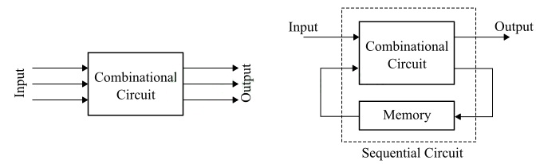
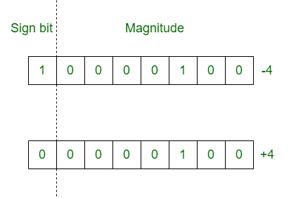

## Objectives

- Digital Electronic

- Number Systems

- Arithmetic Operations in Binary

## Digital Electronic
### Introduction
Digital electronics covers the comprehensive study of digital signals, digital circuits, and digital technologies which are used in electronics, electrical, computers, and communications.  
Digital devices and systems are much faster, accurate, reliable, and efficient as compared to analog electronic devices. This is because digital electronic devices are two-state devices and use binary number system to function. Thus, the operation of these devices toggle between only two binary states namely, on (logic 1) and off (logic 0).  
A digital circuit or system consists of a large collection of logic gates which are interconnected together to implement a specific Boolean or logic function.
### Classification of Digital Electronic Systems
Digital electronic systems are broadly classified into two types namely, combinational systems and sequential systems, and they are 
- **Combinational Systems** A digital electronic system that produces an output according to its current inputs only is referred to as a combinational system. It does not remember the past inputs and outputs. Instead, it determines the output immediately based on the present inputs.
- **Sequential Systems** A sequential system is a digital electronic system that gives output based on both current inputs and past inputs. In sequential systems, a feedback path and memory element are provided to feed some of the outputs back as inputs.



Sequential systems are further classified into the following two types 
- **Synchronous Systems** Those sequential systems that use a clock signal for triggering the change in their state are called synchronous systems.
- **Asynchronous Systems** Those sequential systems that do not use any clock signal and change their state according to applied input are called asynchronous systems.
## Number Systems

Number systems are methods used to represent numbers. In everyday life, we use the decimal system, which employs 10 digits to represent numbers. However, it is not the only system available. Mathematically, there are infinitely many number systems, but the most common ones are the following:

### Common Number Systems

#### Decimal Number System

The most widely used system is the decimal system. It is a base-10 system and uses the digits: {0, 1, 2, 3, 4, 5, 6, 7, 8, 9}. Any number can be represented using only these digits, which we use daily in counting, measuring, and performing arithmetic.

#### Binary Number System

The binary system is used by computers. It is a base-2 system and uses only two digits: {0, 1}. To indicate that a number is in binary, we write it as (N)<sub>2</sub>.

#### Octal Number System

The octal system is a base-8 system and uses the digits: {0, 1, 2, 3, 4, 5, 6, 7}. It is mostly used in computing and digital electronics. Octal numbers are represented with the notation (N)<sub>8</sub>.

#### Hexadecimal (Hex) Number System

The hexadecimal system is a base-16 system. It uses the digits: {0, 1, 2, 3, 4, 5, 6, 7, 8, 9, A, B, C, D, E, F}, where A = 10, B = 11, C = 12, D = 13, E = 14, and F = 15. This system is commonly used in computing to represent color codes, memory addresses, and machine-level data. Hex numbers are written as (N)<sub>16</sub>.

#### Number System Rules

To represent numbers in a base-_x_ system, we need _x_ distinct digits. For example, binary (base 2) uses {0, 1}, octal (base 8) uses {0–7}, and decimal (base 10) uses {0–9}. In general, the digits used range from 0 to x−1.  

**Example:**  

In base 7, we use only these digits: {0, 1, 2, 3, 4, 5, 6}. We cannot use the digit 7 or any number greater than or equal to the base itself.

### Converting Between Bases

#### Converting to Decimal

To convert a number from base x to decimal, multiply each digit by the base raised to the power of its position index, starting from right to left (index 0 on the right). Then sum all the results.

**Formula**:  

If a number is represented as $`(d_nd_{n−1}…d_1d_0)_x`$​, then:  

$`(d_nd_{n−1}…d_0)_x=d_0⋅x^0+d_1⋅x^1+⋯+d_n⋅x^n`$

  

**Examples**:
- $`(1011)_2=1⋅2^0+1⋅2^1+0⋅2^2+1⋅2^3=1+2+0+8=(11)_{10}`$
- $`(37)_8=7⋅8^0+3⋅8^1=7+24=(31)_{10}`$
- $`(5E)_{16}=14⋅16^0+5⋅16^1=14+80=(94)_{10}`$

#### Converting from Decimal to Base X

Converting a decimal number to another base is done using repeated division by the target base. At each step, divide the number by the base, record the remainder, and then use the quotient for the next division. Continue until the quotient is zero. The converted number is the sequence of remainders read from bottom to top.

  

**Steps**:

1. Divide the decimal number by the base.

2. Record the remainder.

3. Replace the number with the quotient and repeat step 1.

4. Stop when the quotient becomes 0.

5. The converted number is the remainders in reverse order.

  

**Example**: Convert $`(78)_{10}`$​ to base 8 (octal)

```

78 ÷ 8 = 9 remainder 6  

 9 ÷ 8 = 1 remainder 1  

 1 ÷ 8 = 0 remainder 1  

```

Reading the remainders from bottom to top: **1 1 6**  

So, $`(78)_{10}=(116)_8`$​

#### Converting between Binary Octal and Hexadecimal

Conversion between binary, octal, and hexadecimal is convenient because all of them are based on powers of 2:

- $8=2^3$

- $16=2^4$

  

The highest digit in the octal system is 7, which is represented in binary as **111**. In hexadecimal, the highest digit is `F`, which equals 15 in decimal and is represented in binary as **1111**.  

means:

- Each digit in octal corresponds to exactly 3 binary digits.

- Each digit in hexadecimal** corresponds to exactly 4 binary digits.

To convert from octal or hexadecimal to binary:

1. Convert each digit to its binary equivalent.

2. Ensure each binary group has the correct number of digits (3 for octal, 4 for hexadecimal).

3. If a binary group has fewer digits, pad it with zeros on the left.

**For example:**  

Converting $`(64)_8`$ to binary
- $`6 =(110)_2`$
- $`4 = (100)_2`$

  

The result will be then $`(64)_8 = (110100)_2`$

Converting $(EC)_{16}$ to binary
- $`E ->14 =(1110)_2`$
- $`C ->12 = (1100)_2`$

  

The result will be then $(EC)_{16} = (11101100)_2$  

To convert from binary to octal or hexadecimal, we simply reverse the process:

- Group the binary number into sets of 3 bits (for octal) or 4 bits (for hexadecimal), starting from the right.

- If the leftmost group has fewer than 3 or 4 bits, pad it with zeros on the left.

- Convert each group to its corresponding octal or hexadecimal digit.

- Combine the digits to get the final number.

  

**For example:**

Convert $`(101110)_2`$ to octal

  - $`(110)_2 = (6)_8`$

  - $`(101)_2 = (5)_8`$

  

The result will be then $`(101110)_2 = (56)_8`$

- Convert $(11010111)_2$ to hexadecimal

  - $`(0111)_2 = (7)_{16}`$

  - $`1101=11 -> (D)_{16}`$

  

The result will be then $`(11010111)_2 = (D7)_{8}`$  

To convert between hexadecimal and octal, we can use the binary system as an intermediate step,First, convert the number to binary, then convert the binary number to the target system (octal or hexadecimal).

#### Converting Between Random Systems

There are infinitely many number systems, and sometimes we need to convert between two systems that don’t have a direct relationship, like base-5 and base-7.  

In such cases, we use the decimal system as an intermediate:

- Convert the number from the original base to decimal.

- Convert the decimal number to the target base.

  

**For example**

Convert $`(132)_5`$ to base 7

  - Convert to decimal $`1.5^2 + 3.5^1 + 2.5^0 = 25 + 15 + 2= 42`$

  - Convert $`(42)_{10}`$ to base-7

```

42 ÷ 7 = 6 remainder 0  

 6 ÷ 7 = 0 remainder 6  

```

The result will be then $`(132)_5 = (60)_{7}`$  

## Arithmetic Operations in Binary

### Introduction

We saw difference number systems and how to work with them and how we can convert from a system to another one, now we will focus on the binary system and how to do the arithmetic operation on the binary system

### Storage

Storage refers to the amount of memory space used to represent data. The smallest unit of storage is a bit, which can hold a value of either `0` or `1`. However, working with single bits is generally not practical, so we commonly group them. A group of 8 bits is called an octet, or more commonly a byte.  

Larger units of storage include:

- **Kilobyte (KB)** = 1,024 bytes

- **Megabyte (MB)** = 1,024 KB

- **Gigabyte (GB)** = 1,024 MB

- **Terabyte (TB)** = 1,024 GB

  

When performing operations on a fixed-size storage type , if the result exceeds the maximum value that can be stored, we encounter a situation called overflow. This means the result "wraps around," leading to incorrect or unintended results.

### Addition

Binary addition works similarly to decimal addition, but follows specific rules based on base-2 arithmetic:

- $`(0)_2 + (0)_2 = (0)_2`$

- $`(0)_2 + (1)_2 = (1)_2`$

- $`(1)_2 + (0)_2 = (1)_2`$

- $`(1)_2 + (1)_2 = (10)_2`$ (which is 0 with a carry of 1)

- $`(1)_2 + (1)_2 + (1)_2 = (11)_2`$ (which is 1 with a carry of 1)

  

This is similar to decimal addition: for example, `5 + 5 = 10`, where the result exceeds the base (10), so we write `0` and carry over `1`. In binary, when the sum exceeds base-2, we also carry the extra value to the next position.  

**Example**

```

  110

+  10

-----

 1000

```

### Multiplication

Binary multiplication is a straightforward operation and works similarly to multiplication in the decimal system. However, since binary has only two digits (`0` and `1`), the multiplication rules are much simpler:

- $`(0)_2 × (0)_2 = (0)_2`$

- $`(0)_2 × (1)_2 = (0)_2`$

- $`(1)_2 × (0)_2 = (0)_2`$

- $`(1)_2 × (1)_2 = (1)_2`$

  

**Example**

```

    1101

x    110

--------

    0000

   1101*

+ 1101*

--------

 1001110

```

### Division

Binary division is similar to long division in the decimal system. The process involves determining how many times the divisor can fit into parts of the dividend, then subtracting and bringing down the next bit. It uses basic subtraction and shifting.  

The key binary division rules are:

- $`(1)_2 ÷ (1)_2 = (1)_2`$

- $`(0)_2 ÷ (1)_2 = (0)_2`$

  

Division by 0 is undefined (just like in decimal)  

**Example**  

Let's divide $`(110)_2`$ by $`(11)_2`$, which is `6 ÷ 3` in decimal:

```

  110 |11

  11  |------

 ---- |10

  00  |

    0 |

    0 |

----- |

  000 |

```

We get a result of $`(10)_2`$, which represents 2 in decimal. The result is correct.

### Subtraction

Binary subtraction can be a bit tricky. Although the rules are simple, difficulties can arise especially when subtracting a larger number from a smaller one or when borrowing is required.  

Here are the basic rules for binary subtraction:

- $`(0)_2 - (0)_2 = (0)_2`$

- $`(0)_2 - (1)_2 = (1)_2`$ requires borrowing (just like in decimal subtraction)

- $`(1)_2 - (0)_2 = (1)_2`$

- $`(1)_2 - (1)_2 = (0)_2`$

  

**Example**  

Doing the following soubstraction $`(1101)_2 - (1011)_2`$ which is `13 - 11`in decimal

```

   1101

-  1011

-------

=  0010

```

We get a result of $`(10)_2`$ which represents 2 in decimal. The result is correct.  

Now lets try the following soubstraction $`(11)_2 - (100)_2`$ which is `3 - 4`in decimal

```

        11

-      100

----------

1111111101

```

We find our self doing infinite borrowing  and getting incorrect results, To solve these issues, scientists introduced new representations for negative numbers in binary, such as sign-and-magnitude, 1’s complement, and 2’s complement.

#### Sign-and-Magnitude Representation

This representation focuses on storing numbers using a fixed number of bits, where the leftmost bit (the most significant bit) is used as the sign bit. It is `0` if the number is positive and `1` if the number is negative.  

  

Before representing a number using this method, we must first decide how many bits will be used for storage. The range of values that can be represented is determined  the following inequality:

  

$`-2^{n-1} + 1 < m < 2^{n-1} - 1`$

  

Where `n` is the total number of bits, and `m` is the number to represent.

Once the bit size is chosen:

1. Set the sign bit to `1` if the number is negative, or `0` if it is positive.

2. Convert the absolute value of the number to binary and place it in the remaining bits.

  

However, sign-and-magnitude representation is not ideal for performing arithmetic operations. It introduces complexity, especially when adding or subtracting signed numbers

#### 1’s Complement Representation

The 1’s complement representation is similar to sign-and-magnitude, as it also reserves the most significant bit (MSB) as the sign bit:

- `0` indicates a positive number

- `1` indicates a negative number

Before representing a number using this method, we must first decide how many bits will be used for storage using the same previous equation:

  

$`-2^{n-1} + 1 < m < 2^{n-1} - 1`$

  

Once the bit size is chosen:

1. Set the sign bit to `1` if the number is negative, or `0` if it is positive.

2. If the number is positive we write it in binary without any change

3. If the number is negative we first start by writing it absolute value on binary then we invert the bits we turn 0 to 1 and 1 to 0.

  

**Example**

- `+5` → `0101`

- `-5` → invert `0101` → `1010`

  

The limitation of this representation is that it has two forms of zero: `0000` (+0) and `1111` (–0). Additionally, arithmetic operations are slightly more complex due to carry handling.  

However, 1’s complement can help simplify subtraction. For example, instead of performing

  

$`(0100)_2 - (0111)_2`$​

we can convert the subtraction into an addition by using the 1’s complement of the second number:

  

$`(0100)_{C1} + (1000)_{C1}`$​

This way, subtraction becomes an addition of the number and the 1’s complement of the subtrahend.

After performing the addition, if the sign bit (the most significant bit) is `1`, it means the result is negative. In 1’s complement, to get the actual value, we apply the 1’s complement again to the result. If the sign bit is `0`, the result is positive, and we keep it as it is.  

**Example**

Doing the following soubstraction $`(11)_2 - (100)_2`$ which is `3 - 4`in decimal  

it become $`(0011)_{C1} + (1011)_{C1}`$

```

  0011

+   1011

--------

  1110

```

The sign bit is `1`, so the result is negative. To get the actual value, we apply the 1’s complement: we invert each bit and then add the negative sign. This gives us `-(0001)`, which represents `–1` in decimal the correct result.

#### 2’s Complement Representation

The 2’s complement representation is the most commonly used method for representing signed binary numbers, especially in modern computers. Like 1’s complement, it also uses the most significant bit (MSB) as the sign bit:

- `0` indicates a positive number

- `1` indicates a negative number

  

Before representing a number using this method, we must first decide how many bits will be used for storage, using the following equation:

  

$`-2^{n-1} \leq m \leq 2^{n-1} - 1`$

  

Once the bit size is chosen:

1. If the number is positive, we write its binary representation directly.

2. If the number is negative, we:

    - Convert the absolute value of the number to binary

    - Invert each bit (1’s complement)

    - Add 1 to the result

  

This final binary value represents the negative number in 2’s complement.  

**Example**

- `+5` → `0101`

- `-5`:

    - Start with `0101`

    - Invert: `1010`

    - Add 1: `1011` →`-5` is `1011` in 2’s complement

  

Unlike 1’s complement, 2’s complement has only one representation for zero: `0000`. This eliminates ambiguity and simplifies arithmetic operations.  

In 2’s complement, subtraction becomes addition by using the 2’s complement of the subtrahend.  

For example, instead of doing:

$`(0011)_2 - (0100)_2`$

We compute:  

$`(0011)_{C2} + (1100)_{C2}`$​

  

Here, `1100` is the 2’s complement of `0100` (which represents `–4`).

**Example:**

Doing the following soubstraction $`(11)_2 - (100)_2`$ which is `3 - 4`in decimal  

it become $`(0011)_{C2} + (1100)_{C2}`$

```

  0011

+ 1100

------

  1111

```

The result is `1111`, the  sign bit is `1`, so the result is negative. To find the actual value we apply 2’s complement: we invert each bit we get  `0000` then we add 1 we get `0001` finally we put the negative sign. This gives us `-(0001)`, which represents `–1` in decimal the correct result.

### Floating Point Numbers

So far, we've learned how to represent and convert integers between binary and decimal. However, it's also possible to work with floating point numbers that is, numbers with a fractional part.

#### Binary to Decimal

Floating point numbers are written in binary the same way as in decimal, with a binary point.  

For example: `1.001` in binary.  

To convert a binary floating point number to decimal:

1. Convert the part before the binary point as usual.

2. Convert the part after the binary point by multiplying each digit by $`2^{-n}`$, where n is the position of the digit after the point (starting from 1).

  

**Example:**  

Convert binary `1.101` to decimal:

- Part before the point: $1 \times 2^0 = 1$

- Part after the point:

    - `1` at position 1: $`1 \times 2^{-1} = 0.5`$

    - `0` at position 2: $`0 \times 2^{-2} = 0`$

    - `1` at position 3: $`1 \times 2^{-3} = 0.125`$

  

Total is  $1+0.5+0+0.125=1.6251$

#### Decimal to Binary

To convert a floating point number from decimal to binary:

1. Convert the part before the decimal point as usual, using successive division by 2.

2. Convert the fractional part, using repeated multiplication by 2.

  

For the fractional part:

- Multiply the decimal fraction by 2.

- The integer part of the result becomes the next binary digit.

- Take the fractional part of the result, and repeat the multiplication.

- Continue this process until the fraction becomes 0, or until you reach the desired number of bits.

  

**Example:**  

Convert `10.625` to binary:

1. **Integer part:**

```

10 ÷ 2 = 5 remainder 0  

 5 ÷ 2 = 2 remainder 1  

 2 ÷ 2 = 1 remainder 0

 1 ÷ 2 = 0 remainder 1

```

The result is 1010

2. **Fractional part (`0.625`):**

```

0.625×2=1.25  keep 1, continue with 0.25

0.25×2=0.5    keep 0, continue with 0.5

0.5×2=1.0     keep 1, stop (fraction is now 0)

```

The result is 101 we read from top to bottom  

We get as final result $`(10.625)_{10} = (1010.101)_2`$

### Remark

Some decimal fractions (like `0.1`) cannot be exactly represented in binary, they result in infinite binary fractions,to handle this, we typically limit the number of bits used after the binary point to a fixed size (e.g., 4 or 8 bits), depending on the precision needed.
