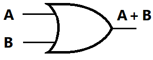

## Objectives
- Boolean Algebra
- Logic Gates 
- Functions and Logic Circuits
## Boolean Algebra
### Introduction to Boolean Algebra
Boolean algebra is a branch of mathematics that deals with variables that have only two possible values: true or false (often represented as **1** and **0**, respectively). It was introduced by George Boole in the 19th century and is fundamental in the fields of computer science, digital electronics, and logic design.  
Unlike traditional algebra, which uses arithmetic operations like addition and multiplication, Boolean algebra uses logical operations.
### Boolean Variables
In Boolean algebra, a Boolean variable is a symbol that represents a value that can be either true (1) or false (0). These variables are used to build logical expressions and perform logical operations.  
Boolean variables are fundamental in digital systems, where they represent the on/off states of electronic signals.
### Boolean Functions
A Boolean function is a mathematical expression made up of Boolean variables, logical operations (like AND, OR, NOT), and constants (0 or 1). It takes one or more Boolean inputs and produces a single Boolean output either 0 (false) or 1 (true).  
Boolean functions are used to represent the logic of digital circuits. Every logic gate (like AND, OR, NOT) performs a basic Boolean function, and more complex circuits use combinations of these to perform tasks like addition, comparison, and memory control.
### Truth Table
A truth table is used to represent a Boolean function by listing all possible combinations of input values and their corresponding output. It helps visualize how a Boolean function behaves for every possible input.  
If two Boolean functions have identical truth tables that is, they produce the same output for every input combination, then the functions are considered equivalent.
### Boolean Algerbra Operator
#### NOT (¬,$`\overline{A}`$) 
The NOT operator inverts the value of a Boolean variable, if we had 1 (true) it become 0 (false) if we had 0 (false) it become 1 (true).  
**Truth Table**

| A   | $`\overline{A}`$ |
| --- | -------------- |
| 0   | 1              |
| 1   | 0              |

#### AND (∧ or . )
The AND operator used with 2 or more boolean variables it return 1 (true) only if all the boolean variables have state of 1.  
**Truth Table**

| A   | B   | A ∧ B |
| --- | --- | ----- |
| 0   | 0   | 0     |
| 0   | 1   | 0     |
| 1   | 0   | 0     |
| 1   | 1   | 1     |
#### OR (∨ or +)
Unlike the AND the OR operator 0 (false) only if all the boolean variables have state of 0.  
**Truth Table**

| A   | B   | A ∨ B |
| --- | --- | ----- |
| 0   | 0   | 0     |
| 0   | 1   | 1     |
| 1   | 0   | 1     |
| 1   | 1   | 1     |
#### XOR (Exclusive OR) Operator
The XO** (exclusive OR) operator, often written as **⊕**, returns 1 (true) only when the boolean variables are differents and it return 0 if the booleans variables have same value 0 or 1.  
**Truth Table**

| A   | B   | A ⊕ B |
| --- | --- | ----- |
| 0   | 0   | 0     |
| 0   | 1   | 1     |
| 1   | 0   | 1     |
| 1   | 1   | 0     |

We can represent A ⊕ B as $`(\overline{A}.B)+(A.\overline{B})`$
### Boolean Algerbra Rules
Boolean algebra follows a set of rules and identities that help simplify and manipulate Boolean expressions.
####  Identity Laws
- **A + 0 = A**
- **A · 1 = A**
#### Null Laws
- **A + 1 = 1**
- **A · 0 = 0**
#### Idempotent Laws
- **A + A = A**
- **A · A = A**
#### Complement Laws
- **A + $\overline{A}$ = 1**
- **A · $\overline{A}$ = 0**
#### Double Negation
- **$\overline{\overline{A}}$ = A**
#### Commutative Laws
- **A + B = B + A**
- **A · B = B · A**
#### Associative Laws
- **(A + B) + C = A + (B + C)**
- **(A · B) · C = A · (B · C)**
#### Distributive Laws
- **A · (B + C) = A·B + A·C**
- **A + (B · C) = (A + B) · (A + C)**
#### Absorption Laws
- **A + (A · B) = A**
- **A · (A + B) = A**
- **A + ($\overline{A}$ · B) = A + B**
### De Morgan’s Laws
De Morgan’s Laws are fundamental rules in Boolean algebra that show how to simplify expressions involving NOT, AND, and OR.  
There are two laws:
1. **$`\overline{A·B} =\overline{A} + \overline{B}`$**
     "The negation of A AND B is the same as NOT A OR NOT B."
2. **$`\overline{{A + B}} = \overline{A} . \overline{B}`$**
     "The negation of A OR B is the same as NOT A AND NOT B."
## Logic Gates
### Introduction
Logic gates are electronic components that implement Boolean algebra operations in physical form. They are the building blocks of digital circuits and are used to create and simulate Boolean functions.  
Each logic gate has one or more inputs and a single output. Both the inputs and output are represented by electrical signals, where:
- 1 (true) is represented by the presence of current (or high voltage)
- 0 (false) is represented by the absence of current (or low voltage)

Logic gates allow us to perform logical operations such as AND, OR, NOT, XOR, and others in hardware, forming the foundation of all modern digital systems, including computers, smartphones, and embedded devices.
### Not Gate
The NOT gate, also known as an inverter, reverses the input signal. If we send a high voltage (1) to its input, it outputs a low voltage (0). Conversely, if we send a low voltage (0), it outputs a high voltage (1). It is represented by the following symbol:  

In the market, a common integrated circuit (IC) for the NOT gate is the IC 7404:  

In this IC:
- Pin 14 is connected to Vcc (positive power supply)
- Pin 7 is connected to GND (ground)
- The remaining pins are used as inputs and outputs for the NOT gates.

The IC 7404 contains six independent NOT gates, meaning you can invert six separate signals using a single chip.
### OR Gate
The OR gate outputs a high voltage (1) if at least one of its inputs is high. It only outputs a low voltage (0) when all inputs are low. In Boolean terms, it performs the logical A + B operation. The symbol for the OR gate is:  
  
A commonly available IC for OR gates is the IC 7432:    
  
In this IC:
- Pin 14 is connected to Vcc (power supply)
- Pin 7 is connected to GND (ground)
- The other pins are used for the inputs and outputs of the OR gates.

The IC 7432 contains four independent OR gates, allowing you to perform OR logic on four separate pairs of inputs using a single chip.
### AND Gate
The AND gate outputs a high voltage (1) only when all of its inputs are high. If any input is low (0), the output will also be low. In Boolean algebra, it performs the logical A · B operation. The symbol for the AND gate is:   
  
A common IC for AND gates is the IC 7408:  

In this IC:
- Pin 14 connects to Vcc (power supply)
- Pin 7 connects to GND (ground)
- The remaining pins are used for inputs and outputs of the AND gates.

The IC 7408 includes four independent AND gates, each with two inputs, allowing you to apply the AND operation to four input pairs using one chip.
### XOR Gate
The XOR gate (Exclusive OR) outputs a high voltage (1) only when the inputs are different that is, one is high and the other is low. If both inputs are the same (both 0 or both 1), the output is low (0). This gate performs the A ⊕ B operation in Boolean algebra. The symbol for the XOR gate is:  
  
A widely used IC for XOR gates is the IC 7486:   
  
In this IC:
- Pin 14 is connected to Vcc
- Pin 7 is connected to GND
- Other pins are used for the input and output connections.

The IC 7486 contains four independent XOR gates, each capable of handling two inputs.
### NAND Gate
The NAND gate (NOT AND) is the inverted version of the AND gate. It outputs a low voltage (0) only when all inputs are high. In all other cases, the output is high (1). In Boolean algebra, it performs the operation ¬(A · B). The symbol for the NAND gate is:  
  
A commonly available IC for NAND gates is the IC 7400:   
  
In this IC:
- Pin 14 is connected to Vcc
- Pin 7 is connected to GND
- The other pins serve as inputs and outputs for the NAND gates.

The IC 7400 includes four independent NAND gates, each with two inputs, making it a versatile choice in digital logic design.
### NOR Gate
The NOR gate (NOT OR) is the inverted version of the OR gate. It outputs a high voltage (1) only when all inputs are low. If any input is high, the output will be low. In Boolean terms, it performs the operation ¬(A + B). The symbol for the NOR gate is:  
  
A standard IC for NOR gates is the IC 7402:  

In this IC:
- Pin 14 is connected to Vcc
- Pin 7 is connected to GND
- The remaining pins are used for inputs and outputs of the NOR gates.

The IC 7402 contains four independent NOR gates, each capable of two-input logic operations.
## Functions and Logic Circuits
### Functions
We can combine logic gates to perform more complex operations and implement custom logic functions. By connecting multiple gates together, we can design circuits that follow specific Boolean expressions. 
For example, consider the Boolean function:  
F = A · B + A · C  
This expression uses AND and OR gates to produce a specific output based on the inputs A, B, and C. The logic circuit combines two AND gates and one OR gate.  
The behavior of this function can be represented using a truth table:  
To create the truth table for a complex Boolean function, follow these steps:
1. We list all possible input combinations for the variables involved (e.g., A, B, and C). For three variables, there are $2^3=8$ combinations.
2. We Break the function into smaller parts to make it easier to evaluate.  
    For the function **F = A·B + A·C**, follow this process:
    - First, calculate the intermediate result of **A·B**
    - Then, calculate **A·C**
    - Finally, compute the result of the full function using **A·B + A·C**

| A   | B   | C   | A·B | A·C | F = A·B + A·C |
| --- | --- | --- | --- | --- | ------------- |
| 0   | 0   | 0   | 0   | 0   | 0             |
| 0   | 0   | 1   | 0   | 0   | 0             |
| 0   | 1   | 0   | 0   | 0   | 0             |
| 0   | 1   | 1   | 0   | 0   | 0             |
| 1   | 0   | 0   | 0   | 0   | 0             |
| 1   | 0   | 1   | 0   | 1   | 1             |
| 1   | 1   | 0   | 1   | 0   | 1             |
| 1   | 1   | 1   | 1   | 1   | 1             |
### Logic Circuits
We can simulate or implement functions using logic circuits. A logic circuit is a physical or visual representation of the function, built using interconnected logic gates such as AND, OR, NOT, and others. These circuits allow us to test and visualize how the function behaves based on different input combinations.
#### Convert Boolean Function to Logic Circuit
To convert a Boolean function into a logic circuit, we follow these steps:
1. First we identify all input variables used in the function.
2. After that we break the function into smaller sub-expressions that are easier to build individually.
3. Then we label intermediate results to make the process more organized.
4. Finally we construct the logic gates for each part, and then connect them together to form the complete circuit.

**Example:** Convert the Boolean function:  
**$F = A·B + \overline{B}·C + D$** 

**Step 1: Identify variables**  
The function involves the inputs **A, B, C, and D**.  
**Step 2: Divide the function into parts**   
Let’s label the intermediate expressions:
- **$M = A·B$** (AND gate)
- **$N = \overline{B}·C$** (NOT gate for B, then AND with C)
- **$O = M + N$** (OR gate to combine M and N)
- **$F = O + D$** (final OR gate with D)

So, the breakdown becomes:  
**$F = (A·B) + (\overline{B}·C) + D = M + N + D = O + D$**

**Step 3: Build the circuit**
- Use an AND gate for **M**
- Use a NOT gate followed by an AND gate for **N**
- Use OR gates to combine **M, N**, and **D**

 

#### Convert Logic Circuit to Boolean Function
Converting a logic circuit into a Boolean function is done by working in reverse order starting from the output and tracing the circuit back to the inputs.
Here’s the step-by-step process:
1. We start at the output gate and identify which logic gate it is (e.g., AND, OR, NOT).
2. Then we Label the inputs of that gate with temporary variables .
3. After that we trace each input wire back to its source gate.
4. We repeat the process recursively for each previous gate, continuing until you reach the original input variables (like A, B, C, etc.).
5. Once all parts are labeled, we substitute each temporary labe with the actual Boolean expression it represents.
6. Finally we combine the expressions step-by-step to write the full Boolean function.

**Example:** Convert the Logic circuit:  

We label the input of each gate that is not a direct input variable, resulting in the following labeled diagram:

We define expressions for each label
- **$F = K · M$**
- **$K = A + B$**
- **$M = O + N$**
- **$O = \overline{B} + C$**
- **$N = C ⊕ D$**

We Substitute step by step
First, substitute **M**:  
 **$M = O + N = (\overline{B} + C) + (C ⊕ D)$**  
Now substitute **F** using **K** and **M**:  
**$F = K · M = (A + B) · ((\overline{B} + C) + (C ⊕ D))$**
 
