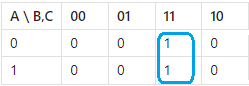
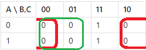
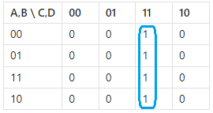
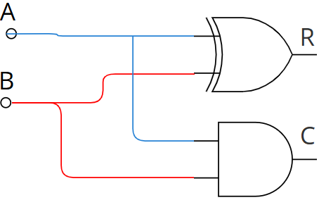
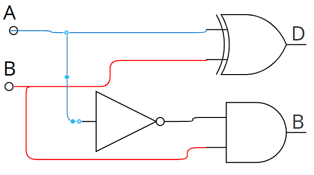
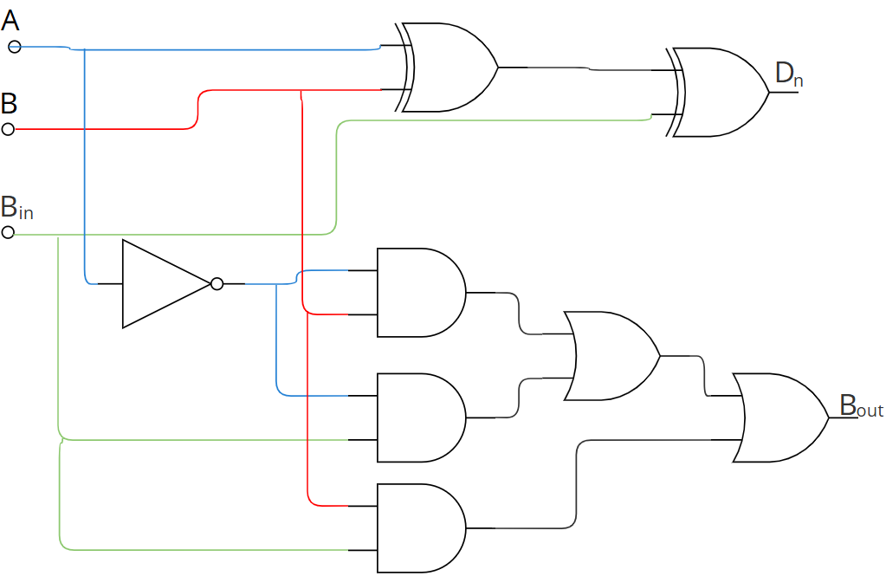
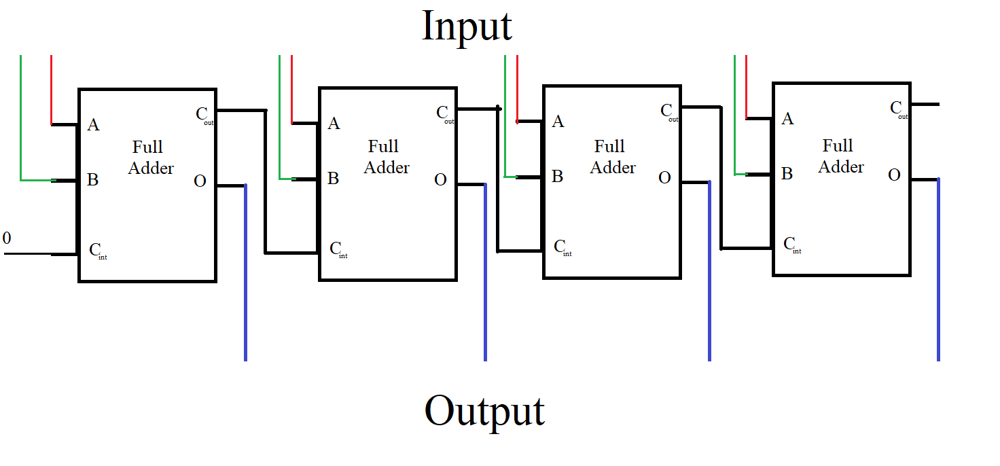

## Objectives
- Canonical Forms
- Simplifying Logic Equations
- Arithmetic Logic Circuits
## Canonical Forms
### Introduction
We have learned how to draw truth tables, design logic circuits from logic functions, and derive functions from logic graphs. However, in some cases, the systems we study behave like black boxes where only the inputs and outputs are known. We don't have access to the internal logic equations or circuits. To analyze and identify such systems, we can use canonical forms to derive their logic expressions.
### Sum of Products Form
The first canonical form is the Sum of Products (SOP). To derive the logic function and identify the system, we start by constructing its truth table. This involves testing all possible input combinations and recording the corresponding outputs.   
Once the table is complete, we focus on the input combinations where the output is **1**. For each of these combinations, we form a product term (also called a minterm) as follows: 
- if an input is 1, we use it as is.
- if it is 0, we write its negation.

We then multiply (AND) the input variables in each combination to form minterms. Finally, we sum (OR) all these minterms to obtain the logic function in Sum of Products form.  
#### Example
We are given the following truth table:

| A   | B   | C   | Output (F) |
| --- | --- | --- | ---------- |
| 0   | 0   | 0   | 0          |
| 0   | 0   | 1   | 1          |
| 0   | 1   | 0   | 0          |
| 0   | 1   | 1   | 1          |
| 1   | 0   | 0   | 1          |
| 1   | 0   | 1   | 0          |
| 1   | 1   | 0   | 0          |
| 1   | 1   | 1   | 1          |
From the truth table we select input combinations where output = 1, we get following input combinations:

| A   | B   | C   |
| --- | --- | --- |
| 0   | 0   | 1   |
| 0   | 1   | 1   |
| 1   | 0   | 0   |
| 1   | 1   | 1   |

Now we create the miniterms for each row where the output is 1:
- If a variable is **0**, we use its negation (e.g., A → $\overline{A}$)
- If a variable is **1**, we use it as it is

Then, we combine the variables using AND (multiplication) to form the minterm.

| A   | B   | C   | Minterm                       |
| --- | --- | --- | ----------------------------- |
| 0   | 0   | 1   | $\overline{A}.\overline{B}.C$ |
| 0   | 1   | 1   | $\overline{A}.B.C$            |
| 1   | 0   | 0   | $A.\overline{B}.\overline{C}$ |
| 1   | 1   | 1   | A.B.C                         |
Now we write the SOP Expression we sum (OR) the minterms to get the final logic function:  
**$F = \overline{A}·\overline{B}·C + \overline{A}·B·C + A·\overline{B}·\overline{C} + A·B·C$**
### Product of Sums Form
The second canonical form is the Product of Sums (POS). To derive the logic function in this form, we again start with the truth table by testing all possible input combinations and recording the outputs.  
Once the table is complete, we focus on the input combinations where the output is 0. For each of these combinations, we form a sum term (also called a maxterm) as follows:
- If a variable is **0**, we use it as is.
- If a variable is **1**, we write its negation.

We then add (OR) the input variables in each combination to form maxterms. Finally, we multiply (AND) all these maxterms together to obtain the logic function in Product of Sums form.
#### Example
We are given the following truth table:

| A   | B   | C   | Output (F) |
| --- | --- | --- | ---------- |
| 0   | 0   | 0   | 0          |
| 0   | 0   | 1   | 1          |
| 0   | 1   | 0   | 0          |
| 0   | 1   | 1   | 1          |
| 1   | 0   | 0   | 1          |
| 1   | 0   | 1   | 0          |
| 1   | 1   | 0   | 0          |
| 1   | 1   | 1   | 1          |
From the truth table we select input combinations where output = 0, we get following input combinations:

|A|B|C|
|---|---|---|
|0|0|0|
|0|1|0|
|1|0|1|
|1|1|0|
Now we create the maxterms for each row where the output is 1:
- If a variable is **0**, we use it as it is
- If a variable is **1**, we use its negation (e.g., A → $\overline{A}$)

Then, we combine the variables using AND (multiplication) to form the minterm.

| A   | B   | C   | Maxterm                             |
| --- | --- | --- | ----------------------------------- |
| 0   | 0   | 0   | $(A + B + C)$                       |
| 0   | 1   | 0   | $(A + \overline{B} + C)$            |
| 1   | 0   | 1   | $(\overline{A} + B + \overline{C})$ |
| 1   | 1   | 0   | $(\overline{A} + \overline{B} + C)$ |
Now we write the POS Expression we multipy (AND) the maxterms to get the final logic function:  
$$F = (A + B + C)· (A + \overline{B} + C) · (\overline{A} + B + \overline{C}) · (\overline{A} + \overline{B} + C)$$
## Simplifying Logic Equations
### Introduction
Simplifying and optimizing logic functions is essential for reducing the cost and complexity of logic circuits. By simplifying a function, we can minimize the number of logic gates required, and in some cases, even discover that certain variables have no effect on the final output. This results in more efficient, faster, and cheaper digital systems.  
There are several techniques used to simplify logic functions. In this section, we will explore the following methods:
### Boolean Algebra Rules
One of the most fundamental ways to simplify logic functions is by using Boolean algebra rules. These rules allow us to manipulate and reduce logical expressions in much the same way we simplify algebraic expressions in mathematics.
#### Example
Let’s suppose we are given the following logic function and want to simplify it:
$$F=A.\overline{B}.\overline{C}+\overline{A}.B.\overline{C}+A.\overline{B}.C+C$$

Step 1: Factor out C from the third and fourth terms

$$F=A.\overline{B}.\overline{C}+\overline{A}.B.\overline{C}+C.(A.\overline{B}+1)$$

In Boolean algebra, any expression ORed with 1 equals 1:

$$A\overline{B} + 1 = 1$$

So the expression becomes:
$$F=A.\overline{B}.\overline{C}+\overline{A}.B.\overline{C}+C$$
Step 2: We factor out $\overline{C}$ from the first two terms

$$F = \overline{C}(A\overline{B} + \overline{A}B) + C$$

Notice that $A\overline{B} + \overline{A}B$ is the definition of exclusive OR (XOR) $A\overline{B} + \overline{A}B= A \oplus B$ 
So the function becomes:

$$F = \overline{C}(A \oplus B) + C$$

Step 3: We apply the identity of Boolean algebra: $X + \overline{X}Y = X + Y$

This matches our form exactly, with $X=C$ and $Y = A \oplus B$, so we can simplify:

$$F = C + (A \oplus B)$$

The final simplified wxpression is $F = C + (A \oplus B)$
### Analysing the Truth Table
Another effective method to simplify logic functions is by analyzing the truth table to identify redundant variables those that do not affect the output. If changing a variable's state does not change the output, it means the function is independent of that variable.  
Let’s understand this through the following examples:
#### Example 1
Consider the following truth table:

|A|B|C|Output (F)|
|---|---|---|---|
|0|0|0|0|
|0|0|1|0|
|0|1|0|0|
|0|1|1|0|
|1|0|0|1|
|1|0|1|1|
|1|1|0|1|
|1|1|1|1|

We observe that:
- When **A = 0**, the output is always **0**
- When **A = 1**, the output is always **1**
- The values of **B** and **C** have no effect on the output

**Conclusion:**  
The output depends only on **A**, so the simplified function is:
$$F=A$$
#### Example 2
Now consider this truth table:

|A|B|C|Output (F)|
|---|---|---|---|
|0|0|0|0|
|0|0|1|1|
|0|1|0|1|
|0|1|1|0|
|1|0|0|0|
|1|0|1|1|
|1|1|0|1|
|1|1|1|0|

To analyze this, we divide the table based on the value of A:  
**When A = 0:**

|A|B|C|F|
|---|---|---|---|
|0|0|0|0|
|0|0|1|1|
|0|1|0|1|
|0|1|1|0|
**When A = 1:**

|A|B|C|F|
|---|---|---|---|
|1|0|0|0|
|1|0|1|1|
|1|1|0|1|
|1|1|1|0|

In both cases, the output depends only on the **XOR** of **B** and **C** and A has no influence on the output:

$$F = B \oplus C$$
### Karnaugh Map
The Karnaugh Map (K-Map) is a graphical tool that helps us analyze and simplify truth tables in a more efficient and visual way. It reduces the complexity of Boolean expressions by organizing minterms or maxterms in a structured format.
#### Steps to Use a Karnaugh Map
1. **Determine the Format:**  
    First we decide whether you're working with:
    - Minterms (for Sum of Products, SOP)
    - Maxterms (for Product of Sums, POS)
2. **Set Up the K-Map:**
    - Then we draw a grid with the appropriate number of rows and columns.
    - After that we assign variable combinations to the rows and columns using Gray code (only one variable changes between adjacent cells).
3. **Fill in the Map:**
    - Now we use the truth table to fill the K-Map with 1s and 0s.
    - For SOP, we place 1s in the cells corresponding to output = 1.
    - For POS, we place 0s in the cells where output = 0.
4. **Group the 1s or 0s:**
    - We group adjacent 1s (for SOP) or 0s (for POS) in powers of 2 (1, 2, 4, 8...).
    - The groups must be rectangular and can wrap around the edges.
    - Finally we simplify each group to a product (AND) or sum (OR) term.
5. **Derive the Simplified Expression:**
    - Write one term per group.
    - Combine all terms with OR (for SOP) or AND (for POS).

When moving from one row or column to the next, only one variable should change its state. This is why we use Gray code instead of binary sequence to label rows and columns. For example, for two variables (B and C), the column labels would be:  00, 01, 11, 10 not 00, 01, 10, 11.  
When we make the groups, we omit the variable that changes and keep only those that don't change, because they represent the variables that our function depends on. Also, when we make the groups, we always take as many as we can.
#### Example 1
Lets suppose we have the following table

| A   | B   | C   | Output (F) |
| --- | --- | --- | ---------- |
| 0   | 0   | 0   | 0          |
| 0   | 0   | 1   | 0          |
| 0   | 1   | 0   | 0          |
| 0   | 1   | 1   | 1          |
| 1   | 0   | 0   | 0          |
| 1   | 0   | 1   | 0          |
| 1   | 1   | 0   | 0          |
| 1   | 1   | 1   | 1          |
We draw the Karnaugh map as follows :

| A \ B,C | 00  | 01  | 11  | 10  |
| ------- | --- | --- | --- | --- |
| 0       | 0   | 0   | 1   | 0   |
| 1       | 0   | 0   | 1   | 0   |
**Using minterms** 
If we want to work with minterms, we group the **1s** in the Karnaugh map instead of the 1s. The groups will be as follows:

We can observe that there is only one group, which represents a single minterm. In this group, A and B remain constant and both are in the 1 state, while C changes. Since C changes, it is not included in the minterm. Because A and B are both 1 and do not change, we include them without negation.
Final simplified expression:  
$$F = A · B$$
**Using maxtems** 
If we want to work with maxterms, we group the **0s** in the Karnaugh map instead of the 1s. The groups will be as follows:

From the green group, we can see that B does not change, while A and C do. Since B remains 0 across this group, we include B as the first maxterm.  
From the red group, C remains constant while A and B change. Since C is 0 in this group, we include C as second maxterms.  
Now we create our function by doing multplication to those maxterms  
$$F=B.C$$
#### Example 2
Lets suppose we have the following table

|A|B|C|D|F|
|---|---|---|---|---|
|0|0|0|0|0|
|0|0|0|1|0|
|0|0|1|0|0|
|0|0|1|1|1|
|0|1|0|0|0|
|0|1|0|1|0|
|0|1|1|0|0|
|0|1|1|1|1|
|1|0|0|0|0|
|1|0|0|1|0|
|1|0|1|0|0|
|1|0|1|1|1|
|1|1|0|0|0|
|1|1|0|1|0|
|1|1|1|0|0|
|1|1|1|1|1|
We draw the Karnaugh map as follows :

| A,B \ C,D | 00  | 01  | 11  | 10  |
| --------- | --- | --- | --- | --- |
| 00        | 0   | 0   | 1   | 0   |
| 01        | 0   | 0   | 1   | 0   |
| 11        | 0   | 0   | 1   | 0   |
| 10        | 0   | 0   | 1   | 0   |
**Using minterms** 
If we want to work with minterms, we group the **1s** in the Karnaugh map instead of the 1s. The groups will be as follows:

We can observe that there is only one group, which represents a single minterm. In this group, C and D remain constant and both are in the 1 state, while A and B changes. Since A and B changes, they are not included in the minterm. Because C and D are both 1 and do not change, we include them without negation.
Final simplified expression:  
$$F = C · D$$
**Using maxtems** 
If we want to work with maxterms, we group the **0s** in the Karnaugh map instead of the 1s. The groups will be as follows:

From the green group, we can see that C does not change, while the other variables do. Since C remains 0 across this group, we include C as the first maxterm.  
From the red group, D remains constant while the other variables change. Since D is 0 in this group, we include D as the second maxterm.  
Now, we create our function by multiplying these maxterms together.
$$F=C.D$$
## Arithmetic Logic Circuits
### Introduction
We learnt that computer use electricity to perfume it operations, this done by using logic circuits using logic gates we  can simulate arthmetic operations on binary , we will see howwe can do addiion and substraction on binary
### Adder Circuit
#### Half Adder
A half adder is a logic circuit that performs simple binary addition of two bits. It takes two binary digits as input and produces two outputs:
- **R**: the result (sum bit)
- **C**: the carry bit

To understand how it works, let’s review basic binary addition:
- $(0)_2 + (0)_2 = (0)_2$
- $(0)_2 + (1)_2 = (1)_2$
- $(1)_2 + (0)_2 = (1)_2$
- $(1)_2 + (1)_2 = (10)_2$ (which is 0 with a carry of 1)

Let’s name the inputs A and B, the sum output R, and the carry output C. Based on this, we can construct the following truth table:

| A   | B   | R (Sum) | C (Carry) |
| --- | --- | ------- | --------- |
| 0   | 0   | 0       | 0         |
| 0   | 1   | 1       | 0         |
| 1   | 0   | 1       | 0         |
| 1   | 1   | 0       | 1         |
From the truth table, we can derive the expressions for the outputs:
- $R = A \oplus B$
- $C = A \cdot B$

**Circuit**

### Full Adder
A full adder extends the half adder by including a third input: the carry-in from the previous bit addition. This allows it to be used in multi-bit binary addition. 
The inputs are:
- $A_n$​: current bit from the first number
- $B_n$​: current bit from the second number
- $C_{n-1}$​: carry-in from the previous bit

The outputs are:
- $R_n$​: result (sum) of the current bit
- $C_n$​: carry-out to the next bit

The full adder truth table is as follows:

| $A_n$ | $B_n$ | $C_{n-1}$ | $R_{n}$ (Sum) | $C_{n}$ (Carry-out) |
| ----- | ----- | --------- | ------------- | ------------------- |
| 0     | 0     | 0         | 0             | 0                   |
| 0     | 0     | 1         | 1             | 0                   |
| 0     | 1     | 0         | 1             | 0                   |
| 0     | 1     | 1         | 0             | 1                   |
| 1     | 0     | 0         | 0             | 1                   |
| 1     | 0     | 1         | 0             | 1                   |
| 1     | 1     | 0         | 0             | 1                   |
| 1     | 1     | 1         | 1             | 1                   |
From this table, we can derive the logic expressions:
- $R_n = A_n \oplus B_n \oplus C_{n-1}$
- $C_n = (A_n \cdot B_n) + (B_n \cdot C_{n-1}) + (A_n \cdot C_{n-1})$

**Circuit**

### Subtractor Circuit

#### Half Subtractor
A half subtractor is a combinational logic circuit used to perform the subtraction of two binary digits. It takes two inputs and produces two outputs:
- D: the difference
- B: the borrow

To understand how it works, let's recall basic binary subtraction:
- $(0)_2 - (0)_2 = (0)_2$
- $(1)_2 - (0)_2 = (1)_2$
- $(1)_2 - (1)_2 = (0)_2$
- $(0)_2 - (1)_2 = (1)_2$​ with a borrow of 1

Let’s name the inputs A (minuend) and B (subtrahend), the output D (difference), and Bo (borrow). Based on this, the truth table is:

|A|B|D (Difference)|Bo (Borrow)|
|---|---|---|---|
|0|0|0|0|
|0|1|1|1|
|1|0|1|0|
|1|1|0|0|

From this truth table, we can derive the output expressions:
- $D = A \oplus B$
- $Bo = \overline{A} \cdot B$

**Circuit**  

#### Full Subtractor

A full subtractor extends the half subtractor by including a third input: the borrow-in from a previous subtraction. This allows the circuit to perform multi-bit subtraction.  
The inputs are:

- $A_n$​: current bit of the minuend
- $B_n$​: current bit of the subtrahend
- $B_{in}$​: borrow from the previous bit

The outputs are:
- $D_n$​: the difference
- $B_{out}$​: borrow to the next bit

The truth table for the full subtractor is:

| $A_n$ | $B_n$ | $B_{in}$​ | $D_n$​ (Difference) | $B_{out}$(Borrow) |
| ----- | ----- | --------- | ------------------- | ----------------- |
| 0     | 0     | 0         | 0                   | 0                 |
| 0     | 0     | 1         | 1                   | 1                 |
| 0     | 1     | 0         | 1                   | 1                 |
| 0     | 1     | 1         | 0                   | 1                 |
| 1     | 0     | 0         | 1                   | 0                 |
| 1     | 0     | 1         | 0                   | 0                 |
| 1     | 1     | 0         | 0                   | 0                 |
| 1     | 1     | 1         | 1                   | 1                 |

From the table, we derive the logic expressions:
- $D_n = A_n \oplus B_n \oplus B_{in}$
- $B_{out} = (\overline{A_n} \cdot B_n) + (\overline{A_n} \cdot B_{in}) + (B_n \cdot B_{in})$

**Circuit**  

### Critical Path Delay
In a previous circuits, we saw how to build a full adder. However, when we need to add two binary numbers with more than one bit, we must connect multiple full adders together we will need n full adders for n-bit numbers. Each full adder receives a carry input from the previous one, forming a chain where the carry propagates through the entire circuit. The path taken by a signal from the input of the first full adder to the output of the last is known as the critical path.  
The critical path is defined as the longest path that a signal must travel through the logic gates from any input to any output. This path determines the maximum delay in a combinational circuit, as each logic operation requires a certain amount of time to complete. In a ripple-carry adder, for example, each full adder must wait for the carry-out from the previous adder before it can produce its result. This creates a sequential dependency that introduces cumulative delay.  
For instance, if we want to add two 4-bit binary numbers using a ripple-carry adder, we would need 4 full adders. If each full adder takes 2 nanoseconds to complete its operation, the total delay would be:
4 × 2ns = 8ns.
This means the circuit requires at least 8 nanoseconds to produce a valid output after the inputs change.  
  

Understanding the critical path delay is essential because it defines the minimum amount of time the circuit needs to compute its output. This delay plays a crucial role when transitioning to sequential logic, where it directly impacts how fast we can clock the system without introducing timing errors.