## Objectives
- Multiplexer and Demultiplexer
- Encoder and Decoder
- BCD, and Gray Code Representation
## Multiplexer and Demultiplexer
### Multiplexer 
A multiplexer is a logical circuit made up of three main parts:
1. **Input lines**
2. **Address (select) lines**
3. **Output line**

A multiplexer has `n` address (select) inputs and $2^n$ data inputs. The address lines are used to select which one of the data inputs is routed to the output.  
For example, a **8:1 multiplexer** has:
- 3 address (select) lines
- 8 input lines  
    The address configuration determines which input is connected to the output. For instance:
- Address `000` selects the **first** input pin
- Address `111` selects the **last** input pin

The structure of a multiplexer is illustrated below:  
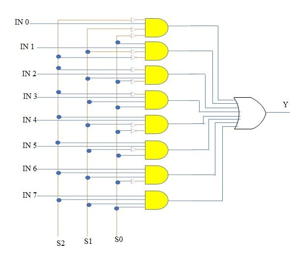
- The $IN_x$ are the input pins
- The $S_x$ are the address (select) pins
- $Y$ is the output

The circuit can be simplified as shown in the following diagram:

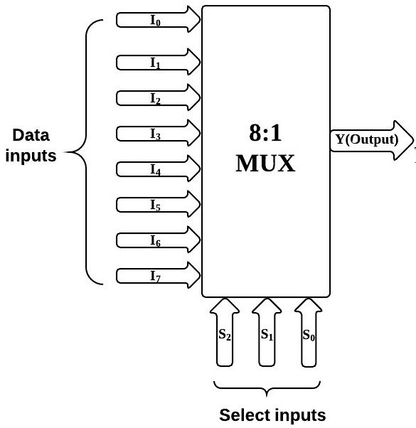

A multiplexer is useful for building and simplifying logic circuits.
#### Using a Multiplexer in Logic Design
Let's suppose we are given the following truth table:

| A   | B   | C   | F   |
| --- | --- | --- | --- |
| 0   | 0   | 0   | 1   |
| 0   | 0   | 1   | 0   |
| 0   | 1   | 0   | 1   |
| 0   | 1   | 1   | 0   |
| 1   | 0   | 0   | 0   |
| 1   | 0   | 1   | 1   |
| 1   | 1   | 0   | 0   |
| 1   | 1   | 1   | 1   |

We can implement this truth table using an 8:1 multiplexer, where:
- Inputs A, B, and C serve as the address (select) lines.
- The values in the F column represent the data inputs to the multiplexer.

The corresponding circuit is shown below:

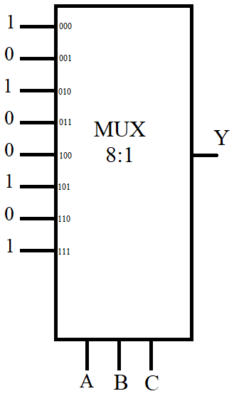

We can simplify the circuit by using a 4:1 multiplexer instead. In this case:
- B and C will be used as address lines.
- **A** will be used to control the output based on logic.

To do this, we restructure the truth table by grouping rows according to values of B and C, and observing how F depends on A:

| A   | B   | C   | F   |
| --- | --- | --- | --- |
| 0   | 0   | 0   | 1   |
| 1   | 0   | 0   | 0   |
| 0   | 0   | 1   | 0   |
| 1   | 0   | 1   | 1   |
| 0   | 1   | 0   | 1   |
| 1   | 1   | 0   | 0   |
| 0   | 1   | 1   | 0   |
| 1   | 1   | 1   | 1   |

Now we analyze the behavior for each combination of B and C:
- Address 00 (B=0, C=0):  
    $F = \overline{A}$
- Address 01 (B=0, C=1):  
    $F = A$
- Address 10 (B=1, C=0):  
    $F = \overline{A}$
- Address 11 (B=1, C=1):  
    $F = A$

Based on this, the inputs of the 4:1 multiplexer will be connected as follows:

|Select (B,C)|Input to MUX|Value|
|---|---|---|
|00|I₀|$\overline{A}$|
|01|I₁|A|
|10|I₂|$\overline{A}$|
|11|I₃|A|

We can now draw the simplified logic circuit using a 4:1 multiplexer and the control signal **A** as input to each data line based on the configuration above.  
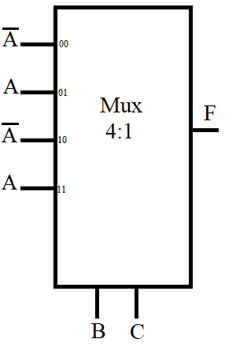

### Demultiplexer
A demultiplexer (or demux) is the opposite of a multiplexer. Instead of selecting one input from many to send to a single output, a demultiplexer routes a single input to one of many outputs, based on the values of its address (select) lines.
A demultiplexer consists of three main parts:
1. **One input line**
2. **Address (select) lines**
3. **Multiple output lines**    

A demultiplexer has `n` address (select) inputs and $2^n$ output lines. The address inputs determine which output line will carry the input signal, while the others will be set to 0 (or remain inactive).  
For example, a 1:8 demultiplexer has:
- 1 input line
- 3 address (select) lines
- 8 output lines

The address configuration determines which output will receive the input signal:
- Address `000` activates **output 0**
- Address `111` activates **output 7**

The structure of a demultiplexer is shown below:

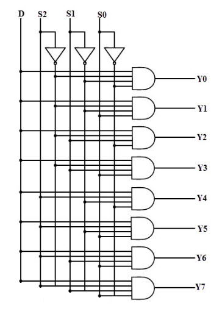

- $D$ is the input signal
- $S_x$ are the address (select) pins
- $Y_x$ are the output lines  
    Only one output will be active at a time, based on the address.

The simplified version of the circuit is shown here:

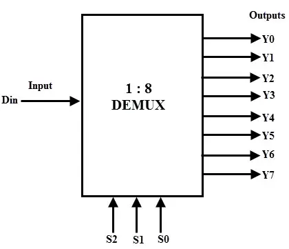  

#### Using a Demultiplexer in Logic Design
Demultiplexers are useful in logic circuits when you want to distribute a signal to one of many destinations, based on select lines. We can also use them to implement logic functions by controlling when specific outputs are activated.  
**Example**  
Suppose we want to implement the following logic function using a 1:8 demultiplexer:

|A|B|C|F|
|---|---|---|---|
|0|0|0|1|
|0|0|1|0|
|0|1|0|1|
|0|1|1|0|
|1|0|0|0|
|1|0|1|1|
|1|1|0|0|
|1|1|1|1|

We can use B, C, and A as the select lines for a 1:8 demux and activate the input only when F = 1.  
To implement the function F, we can OR together the demux outputs that correspond to the adresses where F = 1:
- Adress 000 select the line 0
- Adress 010 select the 2 
- Adress 101 select the 5
- Adress 111 select the 7
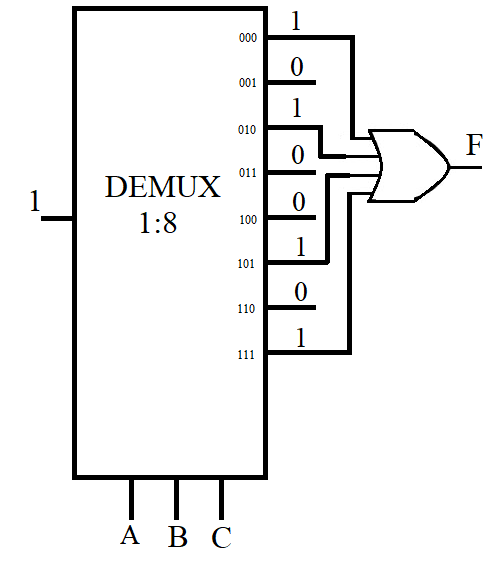
## Encoder and Decoder
### Decoder
A decoder is a combinational logic circuit that converts binary input into a one-hot output only one output line is active (HIGH) for each binary input combination.  
A decoder has:
1. n input lines
2. $2^n$ output lines

Each output line corresponds to one of the possible binary input combinations. For example, a 3-to-8 decoder takes 3 input bits and activates one of the 8 output lines.
#### Structure of a Decoder
The inputs are interpreted as a binary number, and the output line corresponding to that number is set to 1.
For example, in a 3-to-8 decoder:
- Input `000` activates output $Y_0$
- Input `111` activates output $Y_7$

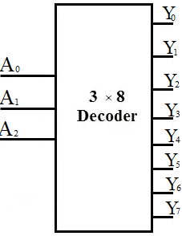

- $A_0$, $A_1$, $A_2$ are the input lines
- $Y_0$ to $Y_7$ are the output lines
#### Truth Table of a 3-to-8 Decoder:

| A₂  | A₁  | A₀  | Y₀  | Y₁  | Y₂  | Y₃  | Y₄  | Y₅  | Y₆  | Y₇  |
| --- | --- | --- | --- | --- | --- | --- | --- | --- | --- | --- |
| 0   | 0   | 0   | 1   | 0   | 0   | 0   | 0   | 0   | 0   | 0   |
| 0   | 0   | 1   | 0   | 1   | 0   | 0   | 0   | 0   | 0   | 0   |
| 0   | 1   | 0   | 0   | 0   | 1   | 0   | 0   | 0   | 0   | 0   |
| 0   | 1   | 1   | 0   | 0   | 0   | 1   | 0   | 0   | 0   | 0   |
| 1   | 0   | 0   | 0   | 0   | 0   | 0   | 1   | 0   | 0   | 0   |
| 1   | 0   | 1   | 0   | 0   | 0   | 0   | 0   | 1   | 0   | 0   |
| 1   | 1   | 0   | 0   | 0   | 0   | 0   | 0   | 0   | 1   | 0   |
| 1   | 1   | 1   | 0   | 0   | 0   | 0   | 0   | 0   | 0   | 1   |

Only one output is HIGH at a time the rest are LOW.
#### Using a Decoder in Logic Design
Suppose we are given the following truth table:

|A|B|C|F|
|---|---|---|---|
|0|0|0|1|
|0|0|1|0|
|0|1|0|1|
|0|1|1|0|
|1|0|0|0|
|1|0|1|1|
|1|1|0|0|
|1|1|1|1|

We can implement this using a 3-to-8 decoder:
- Inputs A, B, and C go into the decoder.
- Each decoder output corresponds to one row in the truth table.
- The function F is defined by OR'ing the outputs where F = 1:
    - F = $Y_0 + Y_2 + Y_5 + Y_7$
        

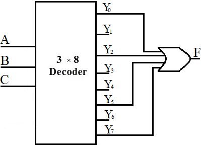

This approach helps simplify Boolean functions and implement them efficiently using decoder logic.
### Encoder
An encoder is a combinational logic circuit that converts multiple input lines into a smaller number of output lines. It performs the reverse operation of a decoder.  
An encoder has:
1. $2^n$ input lines
2. n output lines

Only one input should be active (i.e., HIGH or 1) at a time. The encoder identifies the active input line and outputs the corresponding binary code.  
For example, a 8-to-3 encoder has:
- 8 input lines ($I_0$ to $I_7$)
- 3 output lines ($Y_0$, $Y_1$, $Y_2$)

If $I_5 = 1$ and all other inputs are 0, the output will be the binary representation of 5: `101`.  
Here is the symbol and structure of a typical encoder:

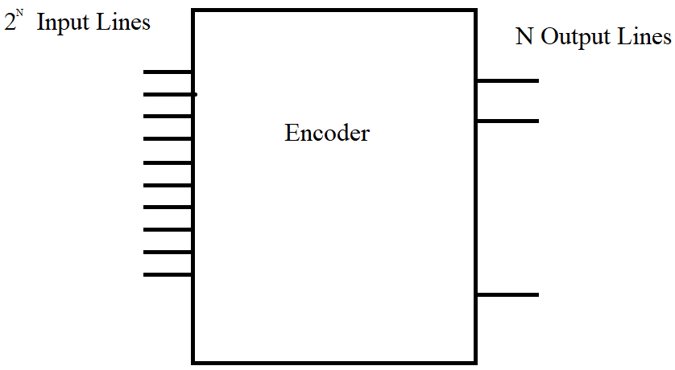

- The $I_x$ are the input lines
- The $Y_x$ are the encoded output lines

The output is determined by the position of the active input line:

|Input Line Active|Output (Y₂Y₁Y₀)|
|---|---|
|I₀|000|
|I₁|001|
|I₂|010|
|I₃|011|
|I₄|100|
|I₅|101|
|I₆|110|
|I₇|111|
#### Priority Encoder
In practical applications, sometimes more than one input line might be active simultaneously. A priority encoder resolves this by assigning priority to the highest-numbered input.  
For instance, if both $I_2 = 1$ and $I_6 = 1$, the encoder will output the binary code for input 6: `110`.  
A typical priority encoder also includes a valid output signal that indicates whether at least one input is active.  
Here is a simplified circuit diagram of a 4-to-2 priority encoder:

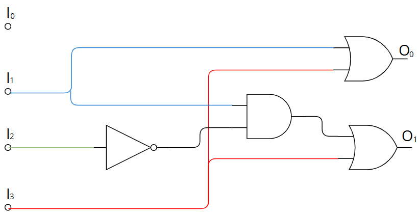

## BCD, and Gray Code Representation
### Introduction
In digital systems, numbers are typically represented in binary form. However, in certain applications, alternative coding schemes are used to improve reliability, compatibility, or ease of interpretation. Two widely known representations are Binary-Coded Decimal (BCD) and Gray code.
### BCD Representation
Binary-Coded Decimal (BCD) is a method of encoding decimal numbers where each digit is represented separately using its 4-bit binary equivalent. This representation is particularly useful in systems that interface with human-readable decimal input or output, such as digital clocks, calculators, and electronic meters.  
In BCD, only the binary combinations from **0000** to **1001** are valid, corresponding to the decimal digits 0 through 9. The table below shows the basic BCD representation for each digit:

| Digit | BCD  |
| ----- | ---- |
| 0     | 0000 |
| 1     | 0001 |
| 2     | 0010 |
| 3     | 0011 |
| 4     | 0100 |
| 5     | 0101 |
| 6     | 0110 |
| 7     | 0111 |
| 8     | 1000 |
| 9     | 1001 |

**Example:**  
To represent the decimal number **17** in BCD:
- First, write the BCD for 1:  **0001**
- Then, write the BCD for 7: **0111**

So the BCD representation of 17 is:   
$17 = (0001 0111)_{BCD}$
### Gray Representation
Gray code is a binary numeral system where two successive values differ by only one bit. This unique property makes Gray code highly valuable in digital systems where minimizing errors during transitions is important such as in analog-to-digital converters, rotary encoders, and error correction in digital communication.  
Unlike standard binary, where multiple bits may change between consecutive numbers, Gray code ensures that only one bit changes at a time. This reduces the risk of misinterpretation caused by timing issues or signal noise during transitions.  
Below is the basic 3-bit Gray code sequence:

|Decimal|Binary|Gray Code|
|---|---|---|
|0|000|000|
|1|001|001|
|2|010|011|
|3|011|010|
|4|100|110|
|5|101|111|
|6|110|101|
|7|111|100|

Gray code representation is especially useful when constructing Karnaugh maps, as it ensures that only one variable changes between adjacent cells
### Converting between BCD and Gray  
#### Converting BCD to Gray
We convert BCD to Gray  by firstly convert BCD decimal then we convert the decimal result to binary after that we convert the binary result to Gray using the following operation
- Keep the first (most significant) bit the same.
- Each next bit = current binary bit XOR previous binary bit.

**Example** convert $`(00100010)_{BCD}`$ to Gray  
The BCD number is split into two 4-bit groups:
- **0010** represents the digit **2**
- **0010** represents the digit **2**

So, the decimal number is:

$`(00100010)_{BCD} = 22_{10}`$

Now we Convert 22 to binary:

$`22 = (10110)_2`$

Finally we Convert Binary to Gray Code, to convert binary $(10110)_2$ to Gray code:
- Keep the first bit the same: `1`
- Perform XOR between each pair of adjacent bits:

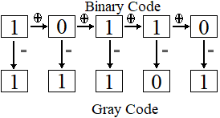

The final Gray code is: $`(11101)_{\text{Gray}}`$

#### Converting Gray to BCD
We convert Gray  to BCD by first converting it to binary then convert the binary number to decimal after that we convert the resut to BCD, we convert Gray to binary we follow this rule
- Keep the first (most significant) bit the same.
- Each next binary bit = previous binary bit XOR current Gray bit.

**Example:** Convert $`(11101)_{\text{Gray}}`$​ to BCD   
We Convert Gray to Binary  Code following this rules:
- Keep the first (most significant) bit the same.
- Each next binary bit = previous binary bit XOR current Gray bit.  
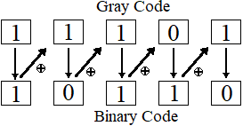

We get as result $(10110)_2$ , now we convert Binary to Decimal  $`(10110)_2 = (22)_{10}`$

Finally we split the decimal number 22 into its digits:
 
- First digit: 2 = $`0010_{BCD}`$
- Second digit: 2 = $`0010_{BCD}`$

**Final Result**:

$`(11101)_{\text{Gray}} = (00100010)_{BCD}`$
