## Objectives
- Introduction to Sequential Logic
- Working with Latches and Flip-Flops
-  Registers 
## Sequential Logic
### Introduction
In digital electronics, sequential logic refers to circuits whose output depends not only on the current inputs but also on the history of inputs in other words, they have memory. Unlike combinational logic, which produces outputs based solely on current inputs, sequential logic circuits can store past information and use it to influence future outputs.  
Sequential circuits are built using fundamental components such as:
- Latches and Flip-Flops basic memory elements that store binary data.
- Clocks  signals used to synchronize state changes.
- Counters and Registers used to count events or hold data.
- Finite State Machines (FSMs) control units that operate based on states and transitions.

Sequential logic is broadly categorized into:
- Synchronous sequential logic  where state changes occur on clock edges.
- Asynchronous sequential logic  where changes depend on input changes and internal feedback.
### Types of Clock Edges
Clock edges are essential for adding timing control to sequential circuits. They determine when a circuit should respond to its inputs or change state. In digital circuits, there are four main types of clocking methods used:
#### Level-Triggered
**High (State 1)** In this method, the circuit is activated when the clock signal is at logic High (1). As long as the clock remains at this level, the circuit may continue to respond to inputs.   
High state trigger represented by the following symbol on circuits

**Low (State 0)** Here, the circuit is activated when the clock signal is at logic Low (0). The circuit may continue to operate as long as the clock stays in the low state.  
Low state trigger represented by the following symbol on circuits

#### Edge-Triggered
To overcome the limitations of level-triggered designs such as unreliable detection when the clock switches too quickly, or when it remains high for too long causing the circuit to oscillate edge triggering was introduced. 
**Rising Edge** (or positive edge) occurs when the clock transitions from **0 to 1**, The circuit only responds at the moment of this transition, ensuring precise timing, it is typically symbolized by an upward arrow or a vertical edge with a rising slope in diagrams.    
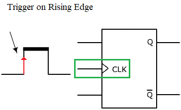

**Falling edge** (or negative edge) occurs when the clock transitions from **1 to 0**, Like the rising edge, it activates the circuit only during this moment of change, it is usually symbolized by a downward arrow or a vertical edge with a falling slope.
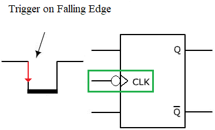
## Latches and Flip-Flops
### Introduction
Latches and flip-flops are the building blocks of sequential logic circuits, they have ability to store data this make their outputs depend on current inputs and also on the past inputs.
- A latch is a level-sensitive device, it changes its output based on the input as long as the control signal is active. Latches are simpler and respond immediately to input changes when enabled.
- A flip-flop, on the other hand, is edge-triggered, typically responding to the rising or falling edge of a clock signal. This makes flip-flops more suitable for synchronous systems where operations are coordinated by a clock.

Both of them store one bit of data and are essential in designing registers, counters, and memory elements in processors and digital systems.
### SR (Set-Reset) 
The first type of latch we encounter is the SR (Set-Reset) latch. This device has two inputs, Set (S) and Reset (R) and one output (Q) somtimesit include additional output ($\overline{Q}$).
- When the Set input (S) is 1 and the Reset input (R) is 0, the latch sets the output Q to 1.
- When S is 0 and R is 1, it resets the output Q to 0.
- When both S and R are 0, the latch retains its previous output state, effectively acting as a memory element.
- However, when both S and R are set to 1 simultaneously, the latch enters a prohibited or invalid state, as it causes a conflict and leads to unpredictable behavior.

|**S (Set)**|**R (Reset)**|**Q (Output)**|**State Description**|
|---|---|---|---|
|0|0|Q (previous)|No change (holds previous)|
|0|1|0|Reset|
|1|0|1|Set|
|1|1|Invalid|**Prohibited state**|
The SR latch is the simplest form of memory storage in digital logic and is commonly implemented using NOR or NAND gates.
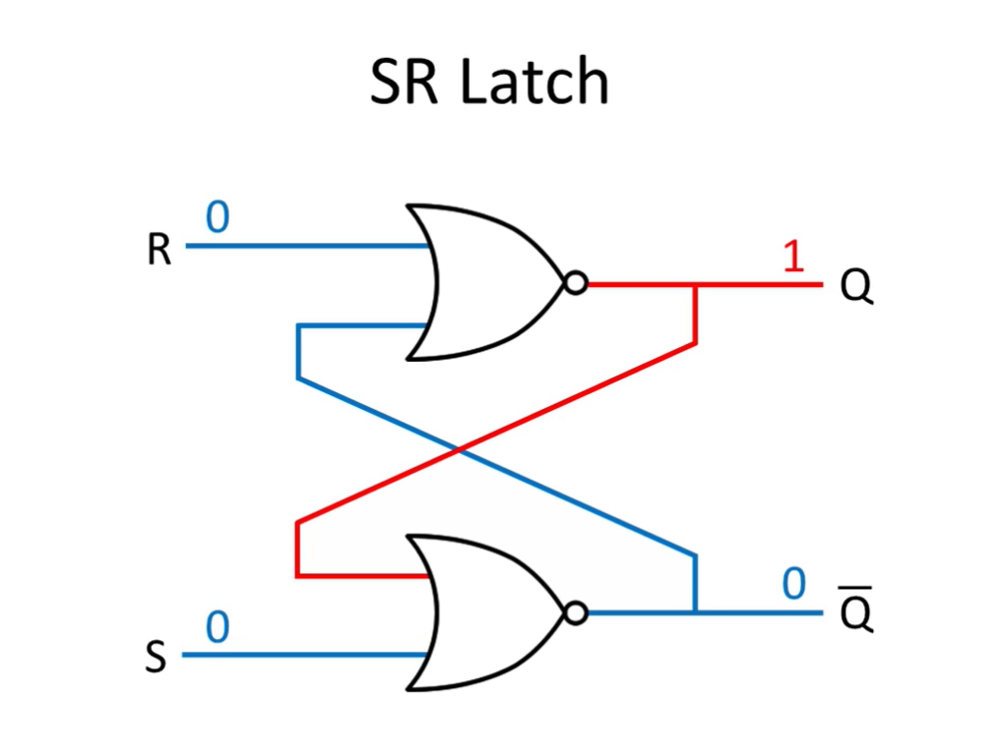
The simplified ciruit look as following  

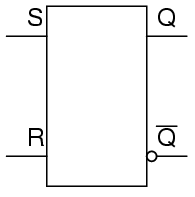

### D (Data or Delay) Latch 
The second type of latch is the D latch, also known as the Data or Delay latch. It has one input (D) and one output (Q), along with a control signal (often called Enable or Clock). The D latch was designed to eliminate the invalid state found in the SR latch, which occurs when both Set and Reset are 1 simultaneously.  
To prevent this condition, the D latch modifies the SR latch by connecting the Set (S) input to D, and the Reset (R) input to the inverted D (i.e., R = $\overline{D}$). This guarantees that Set and Reset are never 1 at the same time, thus avoiding the prohibited state.  
When the Enable signal is active (1), the output Q follows the value of D. When Enable is inactive (0), the output retains its previous state, making it a memory device.

| **Enable (E)** | **D (Input)** | **Q (Output)** | **State Description**     |
| -------------- | ------------- | -------------- | ------------------------- |
| 0              | 0             | Q (previous)   | No change (latched state) |
| 0              | 1             | Q (previous)   | No change (latched state) |
| 1              | 0             | 0              | Q follows D (transparent) |
| 1              | 1             | 1              | Q follows D (transparent) |
The D latch is represented by the following circuit.
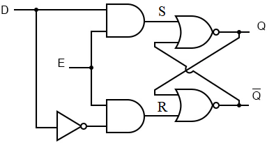

The simplified ciruit represented by  

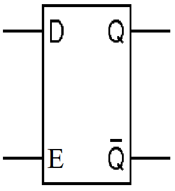
### JK Flip-Flop
The **JK flip-flop** is an improvement over the SR flip-flop. It eliminates the **invalid state** that occurs when both Set and Reset are 1. It has two inputs — **J** and **K** — along with a **clock** input and outputs **Q** and sometimes **$\overline{Q}$**.
- When **J = 0** and **K = 0**, the output remains unchanged (no change).
- When **J = 0** and **K = 1**, the output is reset to 0.
- When **J = 1** and **K = 0**, the output is set to 1.
- When **J = 1** and **K = 1**, the output toggles  it switches to the opposite of its current state.

This flip-flop is edge-triggered, meaning it responds to a clock transition (usually the rising or falling edge). The JK flip-flop is highly versatile and can be used for counting and toggling operations.

| **Clock Edge** | **J** | **K** | **$Q_n$ (Next State)** | **State Description** |
| -------------- | ----- | ----- | ---------------------- | --------------------- |
| ↑ (rising)     | 0     | 0     | $Q_{n-1}$ (previous)   | No change             |
| ↑              | 0     | 1     | 0                      | Reset                 |
| ↑              | 1     | 0     | 1                      | Set                   |
| ↑              | 1     | 1     | $\overline{Q}_{n-1}$   | Toggle                |
The JK flip-flop solves the undefined behavior of the SR flip-flop and is commonly used in digital counters.

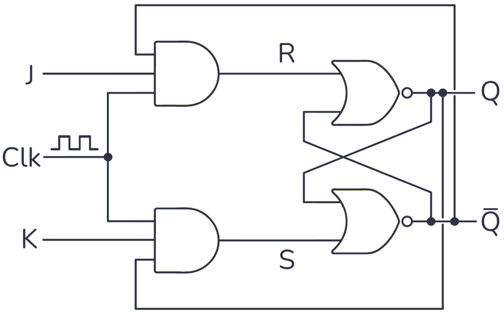  

We can simplify it to the following circuit  

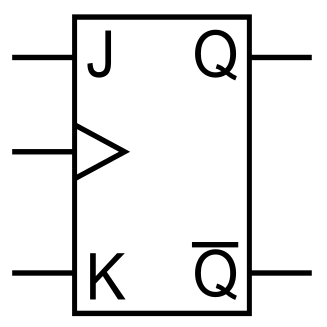
### T (Toggle) Flip-Flop
The T flip-flop is a simplified version of the JK flip-flop, created by connecting both the J and K inputs together. It has a single input T and a clock signal. Its operation is straightforward:
- When **T = 0**, the output remains unchanged.
- When **T = 1**, the output toggles (changes from 0 to 1 or from 1 to 0) on the clock edge.
T flip-flops are often used in **counters** and **frequency division** circuits because of their toggle behavior.

| **T** | **Clock Edge** | **$Q_n$(Next State)** | **State Description** |
| ----- | -------------- | --------------------- | --------------------- |
| 0     | ↑ (rising)     | $Q_{n-1}$ (previous)  | No change             |
| 1     | ↑              | $\overline{Q}_{n-1}$  | Toggle                |
The T flip-flop is useful when only toggling behavior is required, such as in binary counters.

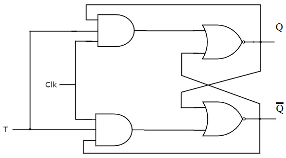  

The simplified ciruit represented by  

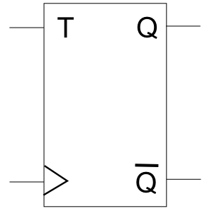
### Timing Diagram
When designing sequential circuits, truth tables can be limited in expressing behavior over time. To address this, we use timing diagrams.   
Timing diagrams provide a clearer and more intuitive way to visualize how inputs and outputs change with respect to time. They not only show the values of signals at specific moments but also illustrate how outputs respond to inputs over time, including the previous states of the system.  
Typically, the first line in a timing diagram represents the clock signal**, followed by lines for inputs, and finally the outputs.
#### Example 
A JK flip-flop with the following inputs and a rising-edge-triggered clock will toggle its output on every rising edge of the clock signal.  
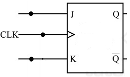  
The output result will be the following using the timing diagram  

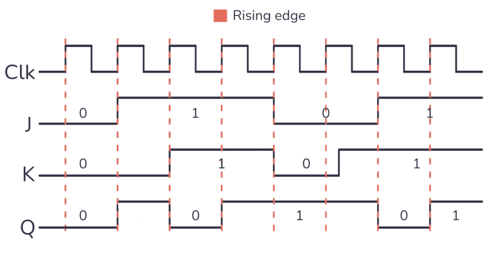    

We can observe that at each rising edge of the clock, the JK flip-flop reads the values of the J and K inputs and updates the output Q accordingly.  
Initially, Q is 0. On the first rising edge, both J and K are 0, so the output remains unchanged. On the second rising edge, J is 1 and K is 0, causing the output to be set to 1. On the third rising edge, both J and K are high, so the output toggles and becomes 0. The same happens on the fourth rising edge since both J and K are still 1, the output toggles again and becomes 1.  
This behavior continues as long as clock pulses are received and the circuit remains powered.  
Timing diagrams offer a clear and intuitive way to visualize and understand the behavior of sequential circuits over time.
### Setup and Hold Time
Flip-flops and latches work with clocks and timing signals. We saw earlier that edge-triggered devices (lflip-flops) can be more precise than level-triggered ones (latches), which makes them useful for building stable sequential circuits. But just relying on the clock edge isn’t enough. There are other timing rules we have to follow to make sure everything works as expected.
Two important constraints you always need to care about when dealing with flip-flops are setup time and hold time. These define when data should be ready and stable in relation to the clock.
#### Setup Time
Setup time is the minimum amount of time that the data input needs to stay stable before the active clock edge. If the data changes too close to the clock edge, the flip-flop might not be able to capture it correctly. It could go into a metastable state, where the output becomes unpredictable or takes too long to settle. This could break things in the rest of your circuit.
#### Hold Time
Hold time is the minimum time the data input must stay stable after the clock edge. If the data changes too soon after the edge, it might still mess with the flip-flop's operation, and the output could again be wrong or unstable.
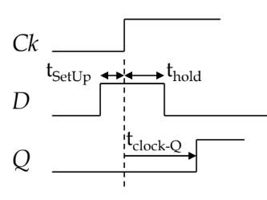
We can see from the output that the data input needs to be set before the clock edge that’s the setup time and it also needs to stay stable for a short time after the clock edge, which is the hold time. Once both of these conditions are met, the flip-flop will respond, but not instantly. The output will change after a small delay known as **Tclock→Q**, which is the time the flip-flop takes to update its output after the clock edge. This delay depends on the internal structure of the flip-flop and also ties into the critical path delay when we look at the full circuit  
When we set the clock period for our circuit, we need to make sure it’s long enough to allow the data to pass through all stages and settle correctly. That’s why we follow this important timing equation:

$$T_{\text{clk}} \geq T_{\text{setup}} + T_{\text{comb}} + T_{\text{clk-to-Q}}$$
Here’s what each part means:

- **$T_{\text{clk}}$**: This is the clock period, or the total time between two active clock edges. It defines how fast our system runs.
- **$T_{\text{setup}}$**: The setup time  how long the data needs to be stable before the next clock edge.
- **$T_{\text{comb}}$**: The delay caused by the combinational logic between flip-flops. This is the actual processing time of the logic gates.
- **$T_{\text{clk-to-Q}}$**: The clock-to-Q delay  how long it takes for the flip-flop to update its output after the clock edge.
This equation shows how the **clock period** must be chosen based on not only the combinational logic delay (**Tcomb**) but also the **setup time** of the receiving flip-flop and the **clock-to-Q** delay of the sending flip-flop.
## Registers
### Introduction
Latches and flip-flops form the fundamental building blocks of sequential circuits, using these elements, we can construct more complex systems by combining multiple flip-flops. For example, by connecting two or more flip-flops together, we can create useful devices such as registers and counters, which are essential in memory storage, data processing, and digital timing operations.
A registers are a group of flip-flops used to store multiple bits of data. Since each flip-flop stores one bit, a register composed of _n_ flip-flops can store _n_ bits. Registers are essential in digital systems for temporary data storage, data transfer, and manipulation of binary values during processing.  
### Types of Registers
Registers come in various types depending on how data is loaded, shifted, or retrieved:  
#### Parallel Register
In this type of register, the flip-flops are not connected to each other in series. Instead, each flip-flop has its own dedicated input and output, connected directly to the data input lines and output ports.  
Data is sent to each pin simultaneously and read from each output independently. A control signal, such as a load or clock signal, controls all flip-flops at the same time, but each bit is handled separately, allowing for parallel data transfer.

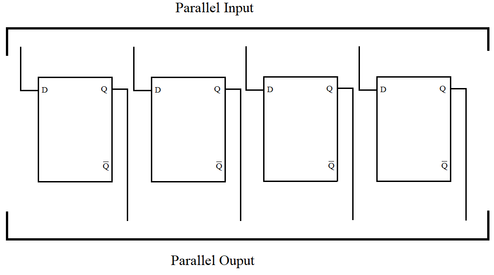    

#### Serial-In Serial-Out (SISO) Register
Unlike parallel registers, the Serial-In Serial-Out (SISO) register transfers data one bit at a time, using a chain of flip-flops.  
In this type of register, the first flip-flop (master) receives the input bit from the serial data line. Each subsequent flip-flop (slave) receives its input from the output of the previous flip-flop.  
On each clock pulse, the data is shifted one step forward along the chain from one flip-flop to the next until it reaches the output.

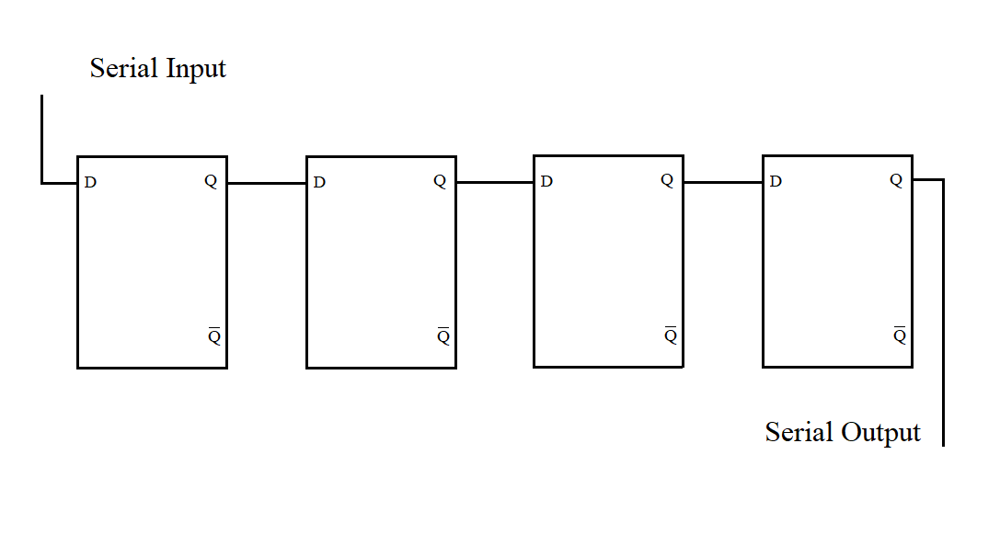    

#### Serial-In Parallel-Out (SIPO)
In a Serial-In Parallel-Out (SIPO) register, data is entered bit by bit into the first flip-flop through a single input line, similar to the SISO register.   
However, instead of waiting for all bits to shift through to the end, each flip-flop has its own output line, allowing the full data to be read simultaneously once all bits are loaded.  
On each clock pulse, the bit in the first flip-flop is shifted to the next one, and so on. After a number of clock pulses equal to the number of flip-flops, the full data is available in parallel at the outputs.  

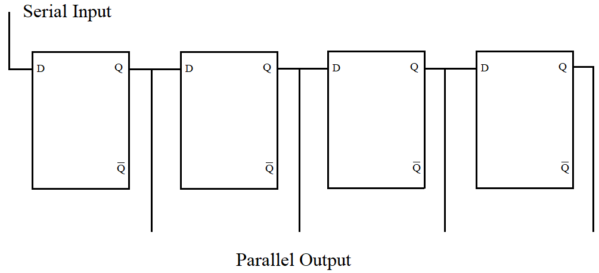   

#### Parallel-In Serial-Out (PISO)
A Parallel-In Serial-Out (PISO) register allows multiple bits of data to be loaded into all flip-flops simultaneously through parallel input lines. Once the data is loaded, it is shifted out one bit at a time through a single serial output line on each clock pulse.  
This type of register is ideal for applications where data is generated or stored in parallel but needs to be transmitted serially, such as in communication systems where transmission bandwidth is limited.  
To operate:
- First, data is loaded in parallel when a load signal is active.
- Then, the register switches to serial mode, where the bits are shifted out from the last flip-flop, one per clock cycle.

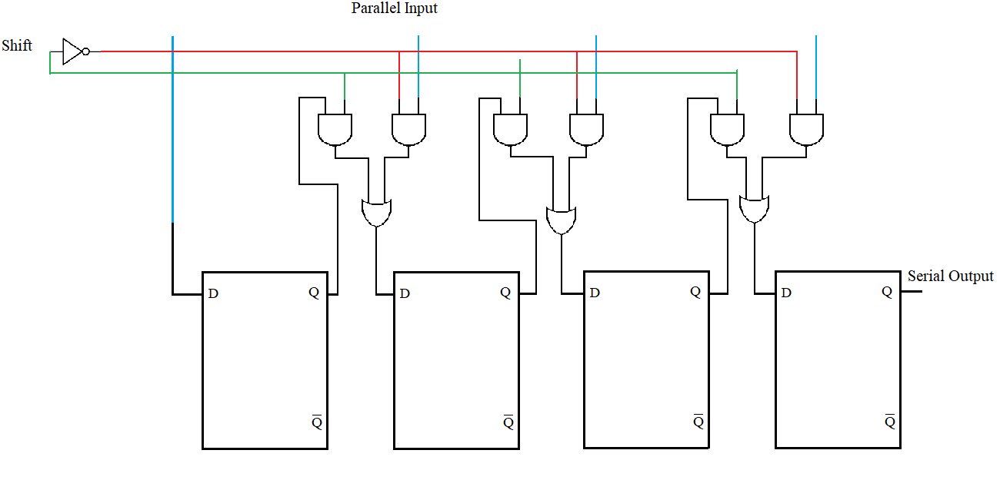   

#### Shift Register
We can group the previous register in 1 category it called shift register which is a sequential digital circuit made up of a series of flip-flops connected in a chain, where the output of one flip-flop becomes the input of the next. It is primarily used to store and shift data in serial or parallel forms, depending on the control inputs and configuration.  
Each clock pulse shifts the data one position along the chain. Shift registers are widely used in digital systems for data conversion (serial-to-parallel and vice versa), temporary storage, and data transfer.  
#### Universal Register
A Universal Register is a special type of shift register that is capable of performing multiple operations including:
- **Parallel loading**
- **Serial loading**
- **Left shifting**
- **Right shifting**
- **Parallel reading**

This versatility is what gives it the name **universal.** It combines the features of all basic types of shift registers (SISO, SIPO, PISO, PIPO) into one circuit, making it highly useful in complex digital systems where flexible data manipulation is required.
### Synchronous and Asynchronous Registers
Registers can also be categorized based on how they respond to clock signals:
#### Synchronous Registers
Synchronous registers are a type of register where all flip-flops are triggered by the same clock signal, meaning that data is transferred or manipulated in a coordinated and simultaneous manner across all stages.  
This synchronization ensures that every flip-flop changes state at the same time, providing consistent and predictable behavior.  
#### Asynchronous Registers
Asynchronous registers are registers in which flip-flops are not all triggered by the same clock signal. Instead, the clock input of each flip-flop may be driven by the output of the previous flip-flop, resulting in a ripple effect. This type of operation is also known as ripple-through or ripple logic.  
Because each flip-flop changes state based on the previous one, there is a delay as the signal propagates through the stages. This delay is known as propagation delay, and it increases with the number of flip-flops in the register.
