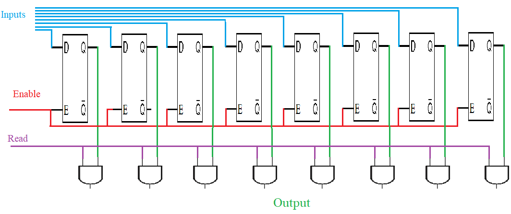

## Objectives
- Counters
- Memories
- Finite State Machines
## Counters
### Introduction
Counters are a special type of register used for counting events or generating sequences of binary numbers (e.g., 0, 1, 2, 3, ...). They play a key role in digital systems such as timers, clocks, and control units.  
There are several types of counters, including:
- **Incrementing counters** (count up)
- **Decrementing counters** (count down)
- **Asynchronous counters**
- **Synchronous counters**

The output of a counter is always represented as a binary number,we can determine how many flip-flops are needed to design a counter, by converting the maximum count value to binary and count the number of bits required. For example, to count up to 15 (which is `1111` in binary), you need 4 flip-flops.
### Synchronous Incrementing Counters
Synchronous counters are counters in which all flip-flops are triggered by the same clock signal. This means that all flip-flops receive the clock pulse simultaneously, ensuring synchronized output changes and faster operation.  
Let’s consider building a Synchronous Incrementing Counter that counts from 0 to 15.
We want to count from `0` to `15`, which in binary is:  
0000, 0001, 0010, 0011, 0100, 0101, 0110, 0111,1000, 1001, 1010, 1011, 1100, 1101, 1110, 1111  
The binary number 1111 has 4 bits, so we need 4 flip-flops to represent these states, we'll use JK flip-flops with a rising-edge clock. we know that this type of flip-flop toggles its output when both J and K inputs are set to 1 and a rising clock edge occurs.  
The timing diagram is represented as following

From this timing diagram we can conclude the following
- **Flip-Flop 0 (Q₀)**: This is the least significant bit (LSB) and toggles on every clock pulse. So, we set J₀ = K₀ = 1.
- **Flip-Flop 1 (Q₁)**: Toggles when Q₀ is **1**, meaning it toggles every time Q₀ transitions from 1 to 0. So we set J₁ = K₁ = Q₀.
- **Flip-Flop 2 (Q₂)**: Toggles when Q₀ AND Q₁ are both 1. So set J₂ = K₂ = Q₀ · Q₁.
- **Flip-Flop 3 (Q₃)**: Toggles when Q₀ AND Q₁ AND Q₂ are all 1. So set J₃ = K₃ = Q₀ · Q₁ · Q₂.

  

### Asynchronous Incrementing Counters
Asynchronous counters, also known as ripple counters, are counters in which only the first flip-flop is triggered by the external clock, and the rest are triggered by the output of the previous flip-flop. This creates a ripple effect, as each flip-flop toggles slightly after the one before it, introducing a small delay between bit changes.  
Let’s suppose we want to build an Asynchronous Incrementing Counter that counts from 0 to 15.
We want to count from `0` to `15`, which in binary is:  
0000, 0001, 0010, 0011, 0100, 0101, 0110, 0111,1000, 1001, 1010, 1011, 1100, 1101, 1110, 1111  
Since `1111` is 4 bits, we need 4 flip-flops to represent all 16 states, we'll use JK flip-flops.  
The timing diagram is represented as following

  

we can see that first JK flip-flops change state with the clock rising edge and the rest change the state with the falling edge by the output of the JK flip flop that come before it , so to desing this circuit we can use 1raising edge flip flop and 3 falling edge flip flop
- **Flip-Flop 0 (Q₀)**: Receives the external clock directly. It toggles on every clock pulse, so set **J₀ = K₀ = 1**.
- **Flip-Flop 1 (Q₁)**: Triggered by falling edge of **Q₀**, not the external clock. Set **J₁ = K₁ = 1**.
- **Flip-Flop 2 (Q₂)**: Triggered by falling edge of **Q₁**. Again, set **J₂ = K₂ = 1**.
- **Flip-Flop 3 (Q₃)**: Triggered by falling edge of **Q₂**. Set **J₃ = K₃ = 1**.

## Memory
### Introduction
Flip-flops and latches are basic memory elements capable of storing a single bit of information that is, they can remember their previous state (either 0 or 1). This means one flip-flop stores one bit.  
By connecting 8 flip-flops together in a Parallel-In Parallel-Out (PIPO) configuration, we can create a register capable of storing 8 bits, which equals 1 byte of data. This register allows us to load or read all 8 bits simultaneously.  
We’re not limited to just one register. Multiple registers can be combined to form a memory array or memory grid with N rows and M columns, where:    
This memory grid behaves like a simple RAM module. To interact with it:
- An address bus is used to select which register we want to access.
- A data bus is used to send (write) or retrieve (read) data to/from the selected register.

This forms the foundation of how modern computer memory operates, using flip-flops and registers as building blocks.
### Creating Simple Memory
Let’s start with a D latch that includes an enable input.
- When the enable signal is active and we send `1` to the D input, the output becomes `1`.
- If we send `0` to the D input while enable is active, the output becomes `0`.
- If the enable signal is turned of**, the output remains unchanged, regardless of changes on the D line.

Now, let’s build a Parallel-In Parallel-Out (PIPO) register using 8 D latches, each representing one bit.  
All latches share the same enable input, allowing us to write 8 bits simultaneously. When we activate the enable line and send 8-bit data through the D inputs, the register stores that information.

We can improve this design by adding a read (R) input for each flip-flop (or latch), which controls whether the stored value is output or not.  
Each output is connected to an AND gate that takes the flip-flop’s stored value and the read signal as inputs.
This means:
- When the enable signal is active, we can write data into the register.
- When the read signal is active, we can read the data stored in the register.

With these enhancements, we can now simplify and visualize the circuit as shown below.  

    

We have input and output fields and also Enable and read signals.  
Now let’s combine 4 of these register units and connect them using a 1-to-4 multiplexer in the following way:
- The enable and read (select) signals of each register are connected to one of the multiplexer’s outputs.
- This setup allows the multiplexer to select which register we want to write to or read from.
- The data inputs of all registers are connected to a common data bus, so data can be sent to all registers.
- The outputs of all registers are connected together using an OR gate. This setup ensures that only the selected register contributes data to the final output line, while the others output 0.

**Reading Data from a Register:**  
When no register is selected, the multiplexer outputs are all 0. This causes each register’s output to be disabled, and the OR gate outputs 0.  
When a specific register is selected, only that register’s output is enabled. Since the others output 0, the OR gate will only pass the selected register’s data to the output bus. This allows selective reading of data.  
**Writing Data to a Register:**
When a register is not selected, its enable line is off, so any data sent through the input bus will not affect it.  
When a register is selected, the enable line activates, and data on the input bus will be written only to that specific register, leaving the others unchanged.  

   

## Finite State Machines
### Introduction
A finite state machine (FSM)  mathematical model used to represent and control the behavior of systems that can exist in a finite number of states at any given time.  
At its core, an FSM consists of a set of states, a set of input events , a set of output actions or responses, and a set of transitions between states based on input events. It can be visualized as a directed graph where nodes represent the states and the edges connecting the nodes represent transitions.
### Types of FSM
#### Deterministic Finite State Machine (DFSM)
In a deterministic FSM, each state transition is uniquely determined by the current state and input. This means that given a specific input and current state, only one possible transition to the next state exists.  
**Exxample:** Vending Machine
Let’s consider a vending machine with three states: Idle, Selection, and Dispense. The transitions between these states depend on user input and the current state. For instance, if the current state is ‘Idle’ and the user selects a product, the machine transitions to the ‘Selection’ state. If the user confirms the selection, the machine moves to the ‘Dispense’ state and dispenses the chosen item. This example showcases a deterministic FSM because, for each input and state, there is a unique next state.  

   

#### Non-deterministic finite state machine (NDFSM)
Non-deterministic FSMs allow multiple transitions for a given input and current state. This means that the next state is not uniquely determined and the machine can be in multiple states simultaneously.  
**Example:** Elevator System  
Let’s consider an elevator system with four floors: Ground, First, Second, and Third. When a user presses a button inside the elevator, the desired floor can be reached in different ways. For instance, if the current state is ‘Ground’ and the user presses the button for the third floor, the elevator can take different paths, such as stopping at the first floor and then on the second floor before finally reaching the third floor. This example illustrates a non-deterministic FSM since multiple transitions are possible for the same input and state.  

   

#### Mealy machine
Mealy machines are FSMs that not only define the states and transitions but also associate outputs with each transition. The outputs in these types of machines rely on both the current state and the input.  
**Example:** Coin-operated Turnstile System  
Consider a coin-operated turnstile system. The turnstile has two states: ‘Locked’ and ‘Unlocked.’ When a coin is inserted (input) while in the ‘Locked’ state, the system transitions to the ‘Unlocked’ state and outputs a signal to allow the person to pass through (output). On the other hand, if someone tries to pass through without inserting a coin (input) while in the ‘Locked’ state, the system remains in this state and outputs a signal indicating that access is denied (output). In this example, the outputs (pass or access denied signals) depend on both the current state and the input, showcasing the behavior of a Mealy machine.  

   

#### Moore machine
A Moore machine is a type of FSM where the outputs depend only on the current state. This implies that regardless of the inputs, the outputs are determined by the state the machine is in. The transitions between states are triggered by the inputs, but the outputs are associated with the states themselves.  
**Example:** Doorbell System  
A doorbell system has two states: ‘Idle’ and ‘Ring.’ When someone presses the doorbell button (input), the system transitions from the ‘Idle’ state to the ‘Ring’ state. In the ‘Ring’ state, the system continuously outputs a ringing sound (output) until the button is released. Once the button is released, the system transitions back to the ‘Idle’ state. In this example, the outputs (ringing sound) depend only on the current state, regardless of the input, illustrating the behavior of a Moore machine.  

   

### State Transition Table
A state transition table represents the system's states and the transitions that occur based on inputs. The structure of this table depends on the type of finite state machine (FSM): for a DFA, it includes current states, inputs, and next states; for Mealy and Moore machines, it may also include outputs.
#### Example
Lets suppose we have the following diagram  

    

To draw the state transition table, we first identify all the states in the system. In this case, we have the following states: A, B, C, and D. 
Next, we determine the transitions based on each current state and input, along with the corresponding output. Here's the analysis:
- When the current state is A:
    - If the input is 0, the system stays in A, and the output is 0.
    - If the input is 1, it transitions to B, and the output is 0.
- When the current state is B:
    - If the input is 0, it transitions to D, and the output is 1.
    - If the input is 1, it transitions to C, and the output is 1.
- When the current state is C:
    - If the input is **0**, it transitions to A, and the output is 0.
    - If the input is 1, it stays in C, and the output is 1.
- When the current state is D:
    - If the input is 0, it transitions to C, and the output is 0.
    - If the input is 1, it transitions to A, and the output is 0.

Based on this, the state transition table is as follows:

| Current State | Input | Next State | Output |
| ------------- | ----- | ---------- | ------ |
| A             | 0     | A          | 0      |
| A             | 1     | B          | 0      |
| B             | 0     | D          | 1      |
| B             | 1     | C          | 1      |
| C             | 0     | A          | 0      |
| C             | 1     | C          | 1      |
| D             | 0     | C          | 0      |
| D             | 1     | A          | 0      |

### Simplifying Finit State Machine
We can simplify a finite state machine (FSM) using the state transition table by following a few steps:
1. **Define Equivalent States**:  
    Equivalent states are those that behave identically when given the same input. In other words, two states are equivalent if they transition to the same next state and produce the same output for all possible inputs. These states can be merged into one, reducing the number of states in the FSM.
2. **Remove Unreachable States**:  
    An unreachable state is one that cannot be reached from the initial state through any sequence of transitions. These states do not contribute to the system's behavior and can be safely removed to simplify the FSM.
#### Example
Let’s suppose we have the following **state transition table**:

| Current State | Input | Next State | Output |
| ------------- | ----- | ---------- | ------ |
| A             | 0     | A          | 0      |
| A             | 1     | B          | 0      |
| B             | 0     | D          | 1      |
| B             | 1     | C          | 1      |
| C             | 0     | A          | 0      |
| C             | 1     | C          | 1      |
| D             | 0     | A          | 0      |
| D             | 1     | D          | 1      |
| E             | 0     | A          | 1      |
| E             | 1     | E          | 0      |

First thing we can notice is that from state A we can never reach state E, which means E is an unreachable state, so we remove it.    
Second thing, we can see that state C and state D behave the same. They give the same output and go to the same or similar destinations for the same input. So we can say they are equivalent and merge them into one state.  
After removing the unreachable state and merging the equivalent states, our new table becomes:

| Current State | Input | Next State | Output |
| ------------- | ----- | ---------- | ------ |
| A             | 0     | A          | 0      |
| A             | 1     | B          | 0      |
| B             | 0     | CD         | 1      |
| B             | 1     | CD         | 1      |
| CD            | 0     | A          | 0      |
| CD            | 1     | CD         | 1      |
