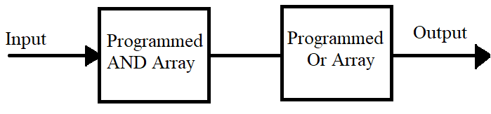

## Objectives
- Programmable Logical Device
## Programmable Logical Device
### Introduction
Programmable Logic Devices (PLDs) are special types of integrated circuits that can be electrically programmed to perform specific logic functions. These devices typically consist of an array of AND and OR gates, which can be configured to implement desired Boolean expressions.  
By setting or modifying the connections between these gates, users can design and implement custom digital logic circuits. There are multiples types of programmable logic devices, distinguished by how the AND and OR gate arrays are organized some use fixed arrays while others support variable or programmable connections.
### Types of Programmable Logical Device
#### Programmable Read Only Memory (PROM)
The PROM (Programmable Read Only Memory) has a fixed AND array (constructed as a decoder) and programmable connections for the output OR gates array. The PROM implements Boolean functions in sum-of-min terms form.

**Example:**
Let's suppose we have a truth table with 3 input variables and 2 output variables. 

|A|B|C|Y1|Y2|
|---|---|---|---|---|
|0|0|0|0|1|
|0|0|1|1|0|
|0|1|0|1|1|
|0|1|1|0|0|
|1|0|0|1|1|
|1|0|1|0|1|
|1|1|0|1|0|
|1|1|1|0|0|
We can implement this truth table using a Programmable Read-Only Memory (PROM). In this case, the PROM uses a 3-to-8 line decoder to generate all possible input combinations, and 2 OR gates to produce the required output functions based on the stored data.
$$Y_1=\sum{(1,2,4,6)}$$
$$Y_2=\sum{(0,2,4,5)}$$
The circuit will be represented as following
  
From the circuit, we can observe that the inputs are hard-wired, meaning they directly drive the decoder and cannot be changed. However, the outputs are configurable, depending on the Boolean functions we want to implement. If we need additional outputs, we can simply add more OR gates connected to the appropriate minterms from the decoder to generate the desired output logic.
#### Programmable Array Logic (PAL)
The **PAL** features a programmable AND array  and a fixed OR array. This is the opposite of PROM, which has a fixed AND array and programmable OR array. In a PAL, users can program the input combinations (product terms), but the way these product terms are combined into outputs is fixed by the hardware. PALs are designed to implement Boolean functions in sum-of-products (SOP) form.

**Example:**  
Let’s use the same truth table with 3 input variables and 2 output variables:

|A|B|C|Y1|Y2|
|---|---|---|---|---|
|0|0|0|0|1|
|0|0|1|1|0|
|0|1|0|1|1|
|0|1|1|0|0|
|1|0|0|1|1|
|1|0|1|0|1|
|1|1|0|1|0|
|1|1|1|0|0|

We can simplify the output logic using Boolean algebra or Karnaugh maps. Suppose we derive the following simplified expressions:

$$Y_1=\overline{A}.C+A.\overline{B}.\overline{C}+\overline{A}.B.\overline{C}+A.B$$
$$Y_2=\overline{A}.\overline{B}.\overline{C}+\overline{A}.B.\overline{C}+A.\overline{B}.\overline{C}+A.\overline{B}.C$$
In PAL, the AND array is programmed to generate these specific product terms. However, the OR array is fixed, and can only sum a limited number of product terms per output.For example we can see this circuit need 2 OR gate with 4 input lines.  
The circuit is illustrated as follows:

The inputs are programmable through the AND array, allowing for custom product term generation. The outputs are less flexible, as the OR connections are predefined. If more outputs are needed or if a function requires more product terms than allowed, we might need to split the design or use multiple PAL devices.
#### Programmable Logic Array (PLA)
The PLA (Programmable Logic Array) offers the highest flexibility among the basic programmable logic devices. It features both programmable AND and OR arrays, allowing users to define custom product terms and how those terms are combined into output functions. This makes it possible to implement complex Boolean functions in sum-of-products (SOP) form with maximum control over both the generation and combination of minterms.  

  

**Example:**  
We’ll use the same truth table with 3 input variables and 2 output variables:

|A|B|C|Y1|Y2|
|---|---|---|---|---|
|0|0|0|0|1|
|0|0|1|1|0|
|0|1|0|1|1|
|0|1|1|0|0|
|1|0|0|1|1|
|1|0|1|0|1|
|1|1|0|1|0|
|1|1|1|0|0|

We simplify the Boolean expressions for outputs using Karnaugh maps or algebraic manipulation and get:

$$Y_1 = \overline{A}.C + A.\overline{B}.\overline{C} + \overline{A}.B.\overline{C} + A.B$$
$$Y_2 = \overline{A}.\overline{B}.\overline{C} + \overline{A}.B.\overline{C} + A.\overline{B}.\overline{C} + A.\overline{B}.C$$

In the PLA, the AND array is programmed to generate all needed product terms, and the OR array is programmed to sum the desired terms for each output. This makes PLA ideal for implementing functions that require complete control over the logic expressions.

The resulting PLA circuit is shown below:

Both the input combinations and the output connections are programmable. This allows for highly customized logic design. If we need more complex outputs or additional functions, the flexibility of PLA supports this without needing additional hardware, as long as the number of inputs and outputs fits within the PLA's capacity.
#### Complex Programmable Logic Device (CPLD)
A **CPLD** is a programmable logic device that combines multiple logic blocks (similar to small PAL or PLA units) on a single chip, connected through a programmable interconnect matrix. Unlike simple devices like PROM, PAL, or PLA, CPLDs offer higher capacity, non-volatile configuration, and predictable timing, making them suitable for medium-complexity designs such as control logic, decoders, and small finite state machines. 
Each logic block in a CPLD contains a number of macrocells, which are programmable elements used to implement logic functions. The predictable structure and fixed timing delays make CPLDs easier to use for designs requiring deterministic behavior.
#### Field Programmable Gate Array (FPGA)

An FPGA is a much more powerful programmable logic device, consisting of thousands (or even millions) of configurable logic blocks (CLBs) connected via a highly flexible routing network. Unlike CPLDs, FPGAs are volatile (they need to be configured at power-up, typically via external memory), but they offer massive parallelism and scalability, making them ideal for complex, high-performance applications such as digital signal processing, custom processors, and real-time video processing.
FPGA design is typically done using Hardware Description Languages (HDLs) like VHDL or Verilog. The internal structure also includes flip-flops, RAM blocks, DSP units, and I/O support, enabling implementation of complete systems on a chip.